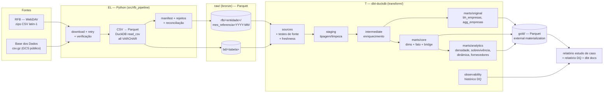
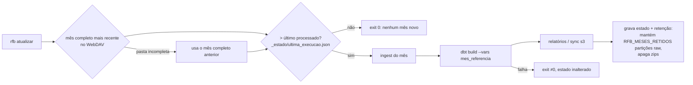
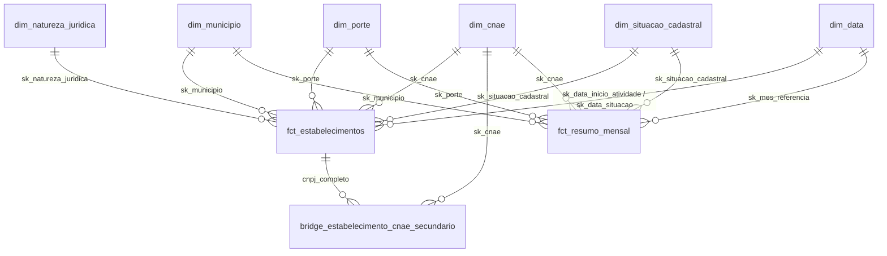

# ARCHITECTURE — Pipeline RFB/CNPJ (dbt + DuckDB + Parquet)

> Documento vivo. Decisões não triviais estão em [docs/adr/](docs/adr/README.md). Escopo original × adições:
> [docs/ESCOPO.md](docs/ESCOPO.md). Produto e personas: [PRODUCT.md](PRODUCT.md).

## 1. Visão geral

ELT em quatro estágios. A extração/carga (EL) é Python; toda transformação (T) é dbt sobre DuckDB, lendo
e escrevendo Parquet. Nenhum dado "vive" só dentro do banco: o arquivo `.duckdb` é descartável e pode ser
recriado a partir dos Parquet.



Mapeamento com a arquitetura medalhão citada no original (notebook 3): `raw/` = bronze; staging +
intermediate + `bh_empresas`/core = silver; `agg_empresas` + análises = gold.

## 2. Stack

| Peça | Escolha | Versão alvo | Motivo (ver ADR) |
|---|---|---|---|
| Linguagem/ambiente | Python via `uv` | 3.12 | reprodutível, lockfile ([ADR-0001](docs/adr/0001-duckdb-dbt-parquet.md)) |
| Motor de consulta | DuckDB | ≥ 1.5 | colunar, lê/escreve Parquet e S3, latin-1 nativo no `read_csv` |
| Transformação | dbt-core + dbt-duckdb | 1.12 / 1.11 (o que o resolver aceitar junto) | modelos SQL versionados, testes, docs, linhagem |
| Pacotes dbt | `dbt_utils`, `dbt_expectations` (metaplane), `dbt_audit_helper` (opcional) | últimos compatíveis | testes genéricos prontos ([ADR-0009](docs/adr/0009-estrategia-testes.md)) |
| Testes Python | pytest (+ `httpx.MockTransport`, `moto[server]`) | — | ingestão e storage sem rede real |
| Lint | sqlfluff (templater dbt/jinja) + ruff | — | padrão de estilo SQL/Python |
| Armazenamento | FS local (`RAIZ_DADOS`) ou S3/Tigris | — | local-first ([ADR-0007](docs/adr/0007-armazenamento-local-s3.md)) |

## 3. Estrutura do repositório

```
.
├── PRODUCT.md  ARCHITECTURE.md  README.md  RETRO.md (final)
├── pyproject.toml  uv.lock  Makefile  .env.example  .sqlfluff  .pre-commit-config.yaml
├── src/rfb_pipeline/           # EL em Python (pacote instalável, CLI `rfb`)
│   ├── configuracao.py               # RAIZ_DADOS, mês de referência, URLs, limiares
│   ├── esquemas.py              # colunas/nomes de cada arquivo RFB e BD (contrato raw)
│   ├── cliente_rfb.py           # listagem WebDAV, detecção do último mês, download c/ retry
│   ├── basedosdados.py         # download das tabelas BD
│   ├── conversao.py              # zip → CSV → Parquet (DuckDB), rejeitos, escrita atômica
│   ├── manifesto.py             # manifesto JSON por execução (checksums, contagens)
│   ├── armazenamento.py              # local vs s3/Tigris (secret DuckDB, sync boto3)
│   ├── publicacao.py                 # publicação opcional do gold no MotherDuck (ADR-0016)
│   ├── report.py               # relatório do estudo de caso e de DQ (Markdown)
│   └── cli.py                  # rfb ingerir | sync | pipeline | report
├── scripts/gerar_fixtures.py     # gera fixtures sintéticas no formato RFB/BD
├── tests/                      # pytest: unit/ e integration/
│   └── fixtures/               # (gerado) zips/csv.gz sintéticos
├── transform/                  # PROJETO dbt
│   ├── dbt_project.yml  profiles.yml  packages.yml
│   ├── models/
│   │   ├── staging/rfb/  staging/basedosdados/
│   │   ├── intermediate/
│   │   ├── marts/original/     # bh_empresas, agg_empresas
│   │   ├── marts/core/         # dims, fato, bridge            (adição)
│   │   ├── marts/analytics/     # marts analíticos              (adição)
│   │   ├── observability/    # histórico e resumo de DQ      (adição)
│   │   └── audit/            # tradução literal do SQL original (paridade; efêmero)
│   ├── seeds/  macros/  tests/ (singulares)  analyses/ (estudo de caso)
├── dados/ (gitignored)          # RAIZ_DADOS padrão
│   ├── raw/rfb/<entidade>/mes_referencia=YYYY-MM/*.parquet
│   ├── raw/bd/<tabela>/*.parquet
│   ├── raw/_rejeitos/  _manifestos/  _baixados/ (cache de zips)
│   ├── gold/<modelo>.parquet
│   └── warehouse.duckdb
└── docs/  adr/  guia-dbt/  ESCOPO.md  QUALIDADE_DADOS.md  PLANO.md  referencia-original/
```

## 4. EL — Ingestão (Python)

### 4.1 Fontes

| Fonte | Local | Arquivos |
|---|---|---|
| RFB CNPJ | WebDAV público `https://arquivos.receitafederal.gov.br/public.php/webdav/` (usuário = token do share `YggdBLfdninEJX9`, senha vazia), pastas `YYYY-MM/` | `Empresas{0..9}.zip`, `Estabelecimentos{0..9}.zip`, `Simples.zip`, `Cnaes.zip`, `Municipios.zip`, `Naturezas.zip`, `Motivos.zip`, `Paises.zip`, `Qualificacoes.zip` (**não** `Socios*`) |
| Base dos Dados | API `https://basedosdados.org/api/tables/downloadTable?p=<b64 dataset>&q=<b64 tabela>&d=<b64 "true">&s=<b64 "free">` (gzip, grátis até 100 MB; ADR-0015) | `br_bd_diretorios_brasil/municipio`, `br_bd_diretorios_brasil/cnae_2`, `br_ibge_populacao/municipio`, `br_ibge_pib/municipio`; **incremento enriquecimento BD (ADR-0015):** `br_ibge_censo_2022/municipio`, `br_geobr_mapas/regiao_metropolitana_2017`, `br_bd_vizinhanca/municipio` |

A URL antiga do original (`/dados/cnpj/dados_abertos_cnpj/2025-02/`) retorna 404 e o mês 2025-02 não está
mais publicado — ver [ADR-0003](docs/adr/0003-fonte-rfb-webdav.md).

### 4.2 Contrato da camada raw

- Um diretório por entidade, particionado Hive por `mes_referencia=YYYY-MM` (RFB). BD não tem partição.
- **Todas as colunas de dados como `VARCHAR`** (schema-on-read; a tipagem é responsabilidade do staging).
- Nomes de colunas RFB = os headers do notebook 1 original em minúsculas (continuidade/rastreabilidade):
  - `empresas`: `cnpj_raiz, razao_social, natureza_jur, qualificacao_resp, capital_soc, porte, ente_fed_resp`
  - `estabelecimentos`: `cnpj_raiz, cnpj_ordem, cnpj_dv, ind_matriz_filial, nome_fantasia, situacao, dat_situacao, mot_situacao, cidade_exterior, pais, dat_inicio_atividade, cnae_principal, cnaes_secundarios, tip_logradouro, logradouro, num_logradouro, compl_logradouro, bairro, cep, uf, municipio, ddd1, tel1, ddd2, tel2, ddd_fax, fax, email, sit_especial, dat_sit_especial`
  - `simples` (adição): `cnpj_raiz, opcao_simples, dat_opcao_simples, dat_exclusao_simples, opcao_mei, dat_opcao_mei, dat_exclusao_mei`
  - domínios (`cnaes, municipios, naturezas, motivos, paises, qualificacoes`): `codigo, descricao`
  - BD: colunas do CSV como vêm (header presente).
- Colunas técnicas adicionadas a toda tabela raw: `_arquivo_origem VARCHAR`, `_mes_referencia VARCHAR`
  (RFB), `_data_referencia DATE` (RFB; data embutida no nome interno do arquivo, ex. `D60912` → 2026-09-12),
  `_ingerido_em TIMESTAMP`.
- Leitura CSV RFB: `delim=';'`, `quote='"'`, `escape='"'`, `header=false`, `encoding='latin-1'`,
  `all_varchar`, colunas nomeadas explicitamente, `store_rejects=true`. Replica as opções do Spark do
  original (escape `"` por causa de `\"` em razões sociais; campos multilinha).
- Campo `""` (vazio entre aspas) é gravado como NULL (padrão do DuckDB); o staging trata vazio e NULL igual.
- Escrita atômica: grava em diretório temporário e renomeia; nunca deixa Parquet parcial.
- Rejeitos do parser → `raw/_rejeitos/<entidade>/mes_referencia=.../*.parquet`. Se a taxa de rejeito
  exceder `RFB_MAX_TAXA_REJEITO` (padrão `0.0001`), a ingestão falha (gate de qualidade na borda).
- **Idempotência:** o manifesto guarda tamanho/sha256 de cada zip e contagens por entidade; reexecutar o
  mesmo mês com os mesmos zips não reprocessa (a menos que `--force`).

### 4.3 Manifesto (`_manifestos/<mes>.json`)

```json
{"mes_referencia": "2026-09", "data_referencia": "2026-09-12", "iniciado_em": "...", "concluido_em": "...",
 "arquivos": [{"nome": "Empresas0.zip", "bytes": 0, "sha256": "...", "entidade": "empresas",
               "linhas_lidas": 0, "linhas_rejeitadas": 0, "parquet": ["..."]}],
 "entidades": {"empresas": {"linhas": 0, "rejeitadas": 0}}, "versao_pipeline": "x.y.z"}
```

### 4.4 Erros e resiliência

| Cenário | Tratamento |
|---|---|
| Rede/timeout/5xx | Backoff exponencial entre tentativas (também após tentativas com progresso); download retoma via `Range` + `If-Range` (ETag/Last-Modified); encerra após 3 falhas seguidas sem progresso (`tentativas`), `RFB_MAX_RETOMADAS` (50) falhas no total ou `RFB_TEMPO_LIMITE_TOTAL_S` (3600 s), com mensagem citando arquivo e URL; PROPFIND usa o mesmo retry; exit 1 sem traceback |
| Tamanho baixado ≠ `getcontentlength` do WebDAV | apaga o arquivo e falha (sem conversão) |
| Zip corrompido | falha antes de converter; nada é escrito em `raw/` |
| Mês inexistente | erro explícito listando os meses disponíveis |
| Taxa de rejeito acima do limiar | falha; rejeitos ficam gravados para auditoria |
| Credenciais S3 ausentes com `RAIZ_DADOS=s3://` | falha imediata com mensagem indicando as variáveis faltantes (também no dbt: o profile `s3` não tem padrão para `AWS_*`) |
| Mês incompleto (faltam `Empresas0–9`, `Estabelecimentos0–9`, `Simples` ou um dos 6 domínios) | sem `--mes` usa o mais recente completo (avisa o ignorado); com `--mes` falha listando os faltantes; `--permitir-incompleto` aceita (usado no `make ci`) |
| Segunda `rfb ingerir` simultânea | falha com "execução em andamento" (lock `RAIZ_DADOS/_estado/rfb.lock`); a limpeza de resíduos só roda com o lock |
| `_data_referencia` nula | aviso explícito por arquivo e ao fim; manifesto grava `data_referencia: null` |

### 4.5 Atualização mensal ([ADR-0012](docs/adr/0012-atualizacao-mensal.md)) — melhoria



- "Mês completo" = pasta com `Empresas0–9`, `Estabelecimentos0–9`, `Simples` e os 6 domínios.
- Histórico mensal em `gold/fct_resumo_mensal/mes_referencia=YYYY-MM/` (uma partição por mês, independente do
  `.duckdb` e da retenção do raw). O dbt grava só a partição do mês processado (`overwrite_or_ignore`) e a
  relação `fct_resumo_mensal` lê todas as partições; `sk_mes_referencia` = 1º dia do mês (`yyyymm01`, chave
  de `dim_data`). Para registrar um mês **antigo**, rode antes `dbt build --select +fct_resumo_mensal --vars
  '{mes_referencia: AAAA-MM}'` (sobrescreve o gold "corrente") e, por último, o build do mês corrente. Receitas de agendamento (cron, launchd, GitHub Actions) em `docs/OPERACAO.md`.

## 5. T — Projeto dbt (`transform/`)

### 5.1 Camadas, materializações e convenções

| Camada | Pasta | Materialização padrão | Convenção de nome | Grão |
|---|---|---|---|---|
| Fontes | `models/staging/*/_*__sources.yml` | — (external_location Parquet) | `source('rfb','empresas')` | arquivo raw |
| Staging | `models/staging/<fonte>/` | `view` | `stg_<fonte>__<entidade>` | 1:1 com a fonte |
| Intermediate | `models/intermediate/` | `table` | `int_<entidade>__<verbo>` | variável |
| Original | `models/marts/original/` | `external` (Parquet em `gold/`) | nomes do original: `bh_empresas`, `agg_empresas` | estabelecimento / estrato |
| Core (adição) | `models/marts/core/` | `external` | `dim_*`, `fct_*`, `bridge_*` | estrela |
| Análises (adição) | `models/marts/analytics/` | `external` | `mart_*` | por pergunta |
| Observabilidade (adição) | `models/observability/` | `table`/`incremental` | `dq_*` | execução × teste |

- Colunas em `snake_case` minúsculo (o original usava `CNAE_principal`, `UF`; DuckDB é case-insensitive,
  mas padronizamos). Mapeamento de nomes em [docs/ESCOPO.md](docs/ESCOPO.md).
- Todo modelo declara `meta: {escopo: original | adicao | adaptado}` e a tag correspondente
  (`escopo_original`, `escopo_adicao`, `escopo_adaptado`) — [ADR-0006](docs/adr/0006-marcacao-escopo.md).
- Marts `original` e `core` têm **contrato** (`contract: enforced: true`) com tipos declarados.
- `external_location` das fontes e `location` dos marts derivam de `env_var('RAIZ_DADOS', '../dados')`.

### 5.2 Variáveis (`dbt_project.yml`)

| Var | Padrão | Uso |
|---|---|---|
| `mes_referencia` | `null` → maior `_mes_referencia` disponível | filtro de partição no staging RFB |
| `data_referencia` | `null` → `_data_referencia` do mês selecionado | cálculo determinístico de idade ([ADR-0004](docs/adr/0004-data-referencia-deterministica.md)) |
| `ano_populacao` | `null` → último ano disponível | join com população |
| `caso_cnae_alvo` | `'4741500'` | estudo de caso (varejo de tintas) |
| `caso_municipio` / `caso_uf` | `'FUNDÃO'` / `'ES'` | estudo de caso |
| `caso_cnaes_fornecedores` | `['2071100','4679601','4679699']` | estudo de caso |
| `raio_fornecedores_km` | `100` | mart de fornecedores próximos |

### 5.3 Modelos

**Staging** (tipagem e limpeza; sem joins):
- `stg_rfb__empresas`: `cnpj_raiz` lpad 8; `natureza_juridica_codigo`; `porte_codigo` int (null se vazio);
  `capital_social` decimal (vírgula → ponto); strings vazias → NULL.
- `stg_rfb__estabelecimentos`: `cnpj_completo` = lpad(raiz,8)||lpad(ordem,4)||lpad(dv,2); datas `YYYYMMDD`
  → `DATE` (`0`, `00000000` e inválidas → NULL); `situacao_codigo` int; `cnae_principal` lpad 7;
  `cnaes_secundarios` texto original + `cnaes_secundarios_lista` (lista); `municipio_rfb_codigo`;
  **descarta** `email`, `ddd*`, `tel*`, `fax` ([ADR-0008](docs/adr/0008-minimizacao-dados-pessoais.md)).
- `stg_rfb__simples`, `stg_rfb__cnaes`, `stg_rfb__municipios`, `stg_rfb__naturezas`, `stg_rfb__motivos`.
- `stg_bd__municipios` (ids como texto, `centroide` → `latitude`/`longitude`), `stg_bd__cnaes`
  (subclasse lpad 7), `stg_bd__populacao`, `stg_bd__pib`; **incremento enriquecimento BD (ADR-0015):**
  `stg_bd__censo_2022_municipio`, `stg_bd__regioes_metropolitanas` (uma região por município; descarta a
  `geometria`), `stg_bd__vizinhanca`.

**Intermediate:**
- `int_municipios__conformados`: RFB ↔ IBGE (via BD) + região imediata/intermediária, micro/meso, população do ano, PIB.
- `int_estabelecimentos__enriquecidos`: estabelecimento × empresa × domínios, com **left joins** e flags de
  correspondência (`tem_cnae_bd`, `tem_municipio_bd`, ...). Base de `bh_empresas` e do core.
- `int_cnaes_secundarios__explodidos`: uma linha por (estabelecimento, CNAE secundário).

**Original (paridade — [ADR-0005](docs/adr/0005-paridade-modelos-originais.md)):**
- `bh_empresas`: mesmas 15 colunas e regras do notebook 3 (inner joins, `porte` N/A/MICRO/PEQUENA/DEMAIS,
  `situacao` ATIVA/INATIVA, `idade_atual` em anos com 1 casa, só para ATIVA). Diferença intencional única:
  idade relativa a `data_referencia` em vez de `now()` (marcada `escopo: adaptado`).
- `agg_empresas`: `group by` das 10 dimensões; `qtd_empresas`, `media_idade`.
- `audit__bh_empresas_sql_original` (modelo efêmero de teste): o SQL do notebook 3 traduzido literalmente
  para DuckDB; um teste singular exige diferença zero contra `bh_empresas`.

**Core — modelo estrela otimizado para BI (adição/melhoria, [ADR-0013](docs/adr/0013-modelo-estrela-bi.md)):**



- Dimensões com chave substituta **inteira** `sk_*` e membro `-1` "NÃO INFORMADO"; hierarquias em colunas
  (`dim_municipio`: região → UF → meso → micro → município; intermediária → imediata. `dim_cnae`: seção → divisão →
  grupo → classe → subclasse). `dim_data` (calendário de 1900-01-01 em diante, `sk_data = yyyymmdd`; membros `-1` NÃO INFORMADO e `-2` DATA INVÁLIDA, com datas contíguas ao calendário).
- `fct_estabelecimentos` (grão CNPJ, só chaves inteiras + flags + medidas; `cnpj_completo` degenerado) — detalhe/DuckDB.
- `fct_resumo_mensal` (agregada, aditiva, histórico por partição mensal; grão mês × município × CNAE × porte × situação × MEI; capital só das matrizes) — **modo Import do Power BI**.
- `bridge_estabelecimento_cnae_secundario` (opcional no BI, muitos-para-muitos). Guia: `docs/POWER_BI.md`.
- **Incremento enriquecimento BD (ADR-0015):** `dim_municipio` ganha `populacao_censo_2022`, `domicilios_2022`,
  `area_km2`, `densidade_hab_km2`, `taxa_alfabetizacao`, `idade_mediana`, `indice_envelhecimento`, `razao_sexo` e
  `nome_regiao_metropolitana` (`NÃO PERTENCE` fora de RM); `bridge_municipio_vizinho` (pares simétricos, ano mais
  recente, sem autopares; opcional no BI).

**Análises (adição):**
- `mart_concorrencia_municipio`: CNAE × município → ativos, inativos, ativos por 10 mil hab., ranking na UF.
- `mart_concorrencia_area_mercado` (**incremento enriquecimento BD**): CNAE × município (pares com estabelecimento local **e** vazios de
  mercado: vizinhos ou RM com ≥ 1 ativo do CNAE e `tem_estabelecimento_local` = false, local 0) → ativos/inativos no
  município, nos vizinhos e na região metropolitana, e ativos por mil domicílios e por km² (município e área =
  município + vizinhos; NULL sem denominador).
- `mart_sobrevivencia_coorte`: coorte (ano de início) × CNAE × porte × UF → n, sobreviventes a 1/3/5 anos, taxas.
  Sobrevivência a N anos: início ≤ `data_referencia − N anos` e (ativa **ou** data de baixa ≥ início + N anos).
- `mart_dinamica_mercado`: ano × CNAE × município → aberturas, encerramentos (situação 08 com `dat_situacao`), saldo.
- `mart_fornecedores_proximos`: para (município alvo, CNAEs de fornecedor) → fornecedores ativos por município
  com distância haversine entre centroides, considerando CNAE principal **e** secundário.

**Observabilidade (adição):** `on-run-end` grava `run_results` (testes: nome, status, falhas, severidade,
escopo) em `dq_historico_testes` (incremental) e `dq_resumo_execucao`; `store_failures` ligado para testes de conteúdo.

### 5.4 Seeds

`dominio_porte.csv` (00/01/03/05 → rótulos), `dominio_situacao_cadastral.csv` (01 NULA, 02 ATIVA, 03
SUSPENSA, 04 INAPTA, 08 BAIXADA), `dominio_matriz_filial.csv`, `excecoes_conhecidas_municipio.csv`
(códigos RFB sem par no BD documentados no original: EXTERIOR e municípios criados após a base BD).

## 6. Qualidade de dados — estratégia

Checks antes e depois de cada etapa; catálogo completo em [docs/QUALIDADE_DADOS.md](docs/QUALIDADE_DADOS.md)
(gerado na Fase 3) e explicação didática no [guia dbt](docs/guia-dbt/README.md). Resumo:

| Etapa | Antes (entrada) | Depois (saída) |
|---|---|---|
| Download | mês existe; tamanho remoto conhecido | tamanho confere; zip íntegro; sha256 no manifesto |
| Conversão | encoding/delimitador fixos | taxa de rejeito ≤ limiar; contagem > 0; nº de colunas |
| Fontes (dbt) | freshness (`_ingerido_em`) | **checks do original** (unicidade/completude dos domínios, integridade natureza/CNAE/município, domínios de porte/situação, contagens plausíveis) |
| Staging | — | tipos/parse de datas, CNPJ 14 dígitos + DV válido, unicidade de `cnpj_completo`, sem datas futuras |
| Intermediate/Original | — | reconciliação de linhas (descartes do inner join quantificados), `sum(qtd_empresas) = count(bh_empresas)`, idade ∈ [0,200], paridade com SQL original, contratos, testes unitários das regras |
| Core/Análises | — | relacionamentos fato→dims, taxas ∈ [0,1], sobrevivência 1a ≥ 3a ≥ 5a, distância ≥ 0 e 0 no próprio município |

Severidade: estrutura (PK, contratos, relacionamentos no core, paridade) = `error`; anomalias de conteúdo =
`warn` com `error_if` por limiar ([ADR-0009](docs/adr/0009-estrategia-testes.md)).

## 7. Execução

| Comando | Faz |
|---|---|
| `make setup` | `uv sync` + `dbt deps` |
| `make fixtures` | gera fixtures sintéticas em `tests/fixtures/` |
| `make ci` | fixtures → `rfb ingerir --origem-local tests/fixtures` → `dbt build --target ci` → pytest integração (tudo em `RAIZ_DADOS` temporário) |
| `make pipeline MES=2026-09` | dados reais: ingest → `dbt source freshness` → `dbt build` → relatórios |
| `make docs` | `dbt docs generate` (+ `serve`) |
| `make lint` | ruff + sqlfluff |
| `make sincronizar` | envia `raw/` e `gold/` para `s3://` (Tigris) |
| `make publicar` | `rfb publicar --destino motherduck [--tabelas a,b]`: recria no MotherDuck as tabelas do `gold/`; só com `MOTHERDUCK_TOKEN` e `MOTHERDUCK_BANCO` (sem eles, "nada publicado", saída 0; ADR-0016) |
| `make atualizar` | `rfb atualizar`: processa o mês novo mais recente, se houver (ADR-0012) |

Perfis dbt (`transform/profiles.yml`): `ci` (fixtures, duckdb em arquivo temporário), `dev` (local),
`s3` (`RAIZ_DADOS=s3://...`; fontes e `gold/` no bucket, mas o `warehouse.duckdb` e os temporários ficam em
`RAIZ_DADOS_LOCAL`; secret DuckDB com `AWS_*`/endpoint Tigris vindos do ambiente, sem padrão).

**Fluxo S3 (ADR-0007):** `rfb ingerir` (local, `RAIZ_DADOS_LOCAL`) → `rfb sincronizar` (`raw/` e `gold/`, comparação por
tamanho + sha256) → `dbt build --target s3`. Variáveis vazias equivalem a ausentes; ver `.env.example`.

**Consumo por BI e publicação opcional (adição, [ADR-0016](docs/adr/0016-publicacao-motherduck.md)):** o `gold/` em
Parquet é o contrato; o Power BI o acessa por (1) Parquet direto, (2) `warehouse.duckdb` via ODBC (views sobre o gold;
um escritor por vez) ou (3) MotherDuck, após `rfb publicar` (desacoplado do dbt: `ATTACH 'md:<banco>'` +
`CREATE OR REPLACE TABLE … AS SELECT * FROM read_parquet(…)`, com `hive_partitioning` na série mensal; o token vem do
ambiente e nunca entra em SQL/log). Com `RAIZ_DADOS=s3://` a publicação recusa (lê gold local). Comparativo e passo a passo:
[docs/POWER_BI.md](docs/POWER_BI.md#como-o-power-bi-acessa-os-dados).

## 8. Segurança e privacidade

- Nenhum segredo no repositório; `.env` gitignored, `.env.example` só com nomes de variáveis.
- Sem dados de sócios; contatos (email/telefone) descartados no staging ([ADR-0008](docs/adr/0008-minimizacao-dados-pessoais.md)).
- Downloads só via HTTPS de hosts em allowlist (`arquivos.receitafederal.gov.br`, `basedosdados.org`).
- Extração de zip protegida contra path traversal (zip-slip).

## 9. Riscos e mitigação

| Risco | Impacto | Mitigação |
|---|---|---|
| RFB muda de novo o local/formato | ingestão quebra | URL/token em config; teste de contrato de colunas; erro claro |
| Volume (~7 GB zip, ~25 GB CSV, ~65 M estabelecimentos) | tempo/memória | conversão streaming por arquivo; `memory_limit`/`temp_directory` no DuckDB; staging em view, intermediate materializado; cache de zips |
| Números diferentes do original (mês diferente) | "paridade" questionada | paridade é **lógica** — teste de paridade compara com o SQL original sobre os mesmos dados |
| Modelo barato gera testes que espelham implementação | falsa segurança | fixtures com respostas conhecidas definidas na spec; revisões Opus por fase; Verifier com sensor de mutação |
| Tigris sem credenciais no ambiente | S3 não testado de verdade | moto server nos testes; teste real opcional documentado |

## 10. Índice de decisões

Ver [docs/adr/README.md](docs/adr/README.md).
