# Plano do projeto, equipe e roteamento de modelos

> Líder/gerente: agente Traycer "Migração dbt DuckDB MVP" (Claude Opus 5.5, esforço alto).
> Regras de seleção: `~/.traycer/agent-selection-guide.md` · Decisão de processo: [ADR-0011](adr/0011-processo-equipe-agentes.md).
> Tarefas detalhadas: [.specs/features/rfb-dbt-port/tasks.md](../.specs/features/rfb-dbt-port/tasks.md).

## Analogia com um time de software

| Papel num time | Quem faz aqui | Modelo / harness | Esforço |
|---|---|---|---|
| Tech lead / arquiteto(a) / PM | Líder (este agente): produto, spec, arquitetura, ADRs, planejamento, integração, verificação por evidência, RETRO | Claude **Opus 5.5** (`claude`) | alto |
| Dev sênior (código crítico e E2E) | Workers dos lotes B3, B5, B8 | Claude **Opus** (`claude`) | médio |
| Dev pleno (tarefa grande não crítica) | — (nenhuma tarefa G/NC neste plano) | Claude **Sonnet** (`claude`) | médio |
| Dev pleno (tarefas médias) | Workers dos lotes B4, B6, B7 (B2 e B9a rodaram em DeepSeek antes da mudança; B9b em Gemini 3.8 Flash por pedido do usuário, AD-021) | Claude **Sonnet** (`claude`) — decisão do usuário, AD-014 | médio |
| Dev júnior (tarefas pequenas) | Worker do lote B1 | **DeepSeek v4 flash** (`openrouter`) | baixo |
| Code reviewer independente | Revisores R1–R5 (sempre agente novo) | Claude **Opus** (`claude`) | alto |
| QA / auditor(a) de segurança / Verifier | R4 (revisão final + auditoria de segurança + Verifier da spec) | Claude **Opus** (`claude`) | alto |
| Correções pós-revisão | Agente novo no mesmo nível da implementação original | idem ao lote de origem | idem |

## Classificação das tarefas

| Tarefa | Descrição curta | Complex. | Critic. | Lote |
|---|---|---|---|---|
| T1 | Ambiente Python + Makefile | P | NC | B1 |
| T2 | Esqueleto dbt (project/profiles/packages) | P | NC | B1 |
| T3 | Lint + pre-commit | P | NC | B1 |
| T4 | Gerador de fixtures com cenário conhecido | M | NC | B2 |
| T5 | Config + contrato de schemas raw | M | NC | B2 |
| T6 | Cliente WebDAV RFB | M | NC | B2 |
| T7 | Download Base dos Dados | M | NC | B2 |
| T8 | Conversão zip/CSV → Parquet raw | **G** | **C** | B3 |
| T9 | Manifesto + idempotência | M | NC | B4 |
| T10 | CLI `rfb ingerir` + `make ci` | M | NC | B4 |
| T11 | Storage S3/Tigris + `rfb sincronizar` | M | NC | B4 |
| T12 | Fontes dbt + checks do original + freshness | M | NC | B4 |
| T13 | Staging de domínios/BD + macros | M | NC | B4 |
| T14 | Staging empresas/estabelecimentos | **G** | **C** | B5 |
| T15 | `bh_empresas` + paridade | M | **C** | B5 |
| T37 | Padronização de nomes (ADR-0014, pedido do usuário) | M | NC | RN |
| T32 | Fixtures: 2º mês (2026-08) + testes por mês | M | NC | B6 |
| T16 | `agg_empresas` + reconciliação | M | NC | B6 |
| T17 | `dim_municipio` | M | NC | B6 |
| T18 | `dim_cnae` e dims de domínio | M | NC | B6 |
| T33 | `dim_data` (calendário) — melhoria BI | M | NC | B6 |
| T19 | `fct_estabelecimentos` (chaves inteiras p/ BI) | M | NC | B6 |
| T20 | Bridge CNAEs secundários | M | NC | B6 |
| T21 | Densidade de concorrência | M | NC | B7 |
| T22 | Sobrevivência por coorte | M | NC | B7 |
| T23 | Dinâmica de mercado | M | NC | B7 |
| T24 | Fornecedores por distância | M | NC | B7 |
| T25 | Testes genéricos DQ + governança de escopo | M | NC | B7 |
| T26 | Histórico de DQ + catálogo | M | NC | B7 |
| T27 | Estudo de caso + relatório | M | NC | B7 |
| T34 | `fct_resumo_mensal` com histórico por partição — melhoria | M | NC | B7b |
| T35 | Guia Power BI + exposure — melhoria | M | NC | B7b |
| T28 | Pipeline E2E com dados reais | M | **C** (E2E) | B8 |
| T38 | Download BD pela API atual — incremento enriquecimento BD | M | NC | B10 |
| T39 | Novas tabelas BD no raw + fixtures — incremento enriquecimento BD | M | NC | B10 |
| T40 | `dim_municipio` enriquecida + vizinhança — incremento enriquecimento BD | M | NC | B10 |
| T41 | Concorrência na área de mercado + estudo de caso — incremento enriquecimento BD | M | NC | B10 |
| T42 | `rfb publicar --destino motherduck` (opcional) — melhoria | M | NC | B11 |
| T43 | Guia Power BI: como acessar os dados — melhoria | M | NC | B11 |
| T36 | `rfb atualizar` (mês novo, completude, retenção, agendamento) — melhoria | M | NC (E2E → Opus) | B8 |
| T29 | Guia dbt — fundamentos | M | NC | B9a (paralelo) |
| T30 | Guia dbt — fluxo, testes, DQ | M | NC | B9b |
| T31 | Guia dbt — bibliotecas/técnicas + índice/README | M | NC | B9b |

Críticas ou grandes: **T8, T14, T15, T28** (4 = limite).

Melhorias pedidas pelo usuário em 2026-09-28 (ADR-0012 atualização mensal, ADR-0013 modelo estrela para Power BI): T32–T36 e ajustes BI em T17–T19.

## Sequência de execução

```mermaid
flowchart LR
  P0[Planejamento<br/>líder] --> B1[B1 fundação<br/>DeepSeek low] --> B2[B2 fixtures/clientes<br/>DeepSeek high] --> B3[B3 conversão<br/>Opus med] --> B4[B4 ingestão/fontes<br/>Sonnet med] --> R1{{R1 revisão<br/>Opus high}}
  R1 --> B5[B5 staging+bh_empresas<br/>Opus med] --> RN[RN padronização de nomes<br/>Sonnet med] --> R2{{R2 revisão<br/>Opus high}}
  R2 --> B6[B6 agg+star schema<br/>Sonnet med] --> B7[B7 análises/DQ/caso<br/>Sonnet med] --> B7b[B7b série mensal + Power BI<br/>Sonnet med] --> R3{{R3 revisão<br/>Opus high}}
  R3 --> B8[B8 E2E real + rfb atualizar<br/>Opus med] --> R4{{R4 revisão final + auditoria<br/>+ Verifier — Opus high}}
  B1 -.paralelo.-> B9a[B9a guia fundamentos<br/>DeepSeek high]
  R3 -.paralelo com B8.-> B9b[B9b guia fluxo/testes/libs<br/>Sonnet med] --> R5{{R5 revisão docs<br/>Opus high}}
  R4 --> F[RETRO + billing<br/>líder]
  R5 --> F
```

- Cada lote roda num **worktree git** próprio (branch `lote/bN-...`) com agente **novo**; o líder faz merge em `main`
  só depois de reexecutar os gates e conferir `git log`.
- Lotes de código são sequenciais; trilhas de documentação (arquivos disjuntos) correm em paralelo.
- Correções apontadas por revisão: agente novo no nível da tarefa de origem.
- Worker que parar sem commit/relatório é substituído por um de nível superior, que faz triagem do diff herdado.
- Escada de escalonamento: DeepSeek v4 flash → Claude Sonnet (médio) → Claude Opus (médio).

## Status (atualizado pelo líder)

| Lote | Status | Agente | Commits |
|---|---|---|---|
| P0 Planejamento | concluído | líder (bc8ec47f) | `bd773a5` |
| B1 | concluído, verificado e integrado | c64e33f0 · opencode `ses_f1673ddc3ffe6aFmwW2gXtoYDI` · DeepSeek v4 flash low (confirmado) | `a1f21c0` `2971b0b` `9816e88` |
| B2 | worker 1 falhou (parou sem commit: `finish=length`, estouro de saída) → substituído e escalado | e4e76ec8 · opencode `ses_f166a54c8ffezXsUR5KUGpjDx0` · DeepSeek v4 flash high (arquivado) | — |
| B2 (substituto) | concluído, verificado (34 testes, fixtures determinísticas, parse DuckDB conferido) e integrado | 1a15ce55 · Claude Sonnet médio (escalonamento pela regra do guia) | `2253d8e` `054a98c` `bc8896e` `8b4f283` |
| B3 | concluído, verificado (67 testes; validação real: Empresas1 4.494.860 linhas/0 rejeitos/1,2 s; Estabelecimentos1 4.753.435/0/4,1 s) e integrado | 31f7d382 · Claude Opus médio | `ddc0731` |
| B4 | concluído, verificado (90 unit + 5 integração; dbt PASS=45 WARN=1 ERROR=0; `make ci` 6,8 s) e integrado | c1dc175c · Claude Sonnet médio | `cf37463` `dc38939` `e72dc84` `f7d2603` `8bdbadc` `ea00fe5` `f109d49` |
| R1 | concluída: APROVADO COM RESSALVAS (0 bloq., 10 imp., 14 menores, 3 sug.; 20 mutações) — triagem em `docs/revisoes/R1-triagem.md` | a84e9afe · Claude Opus alto (traycer-review) | `f5d3119` |
| F1a | concluído, verificado (153 unit + 18 integração; dbt PASS=61 WARN=1 ERROR=0; `make ci` 19,9 s; pre-commit ok) e integrado — 20 achados da R1 + P7 | eba62c6d · Claude Sonnet médio | `d45ef8d` `fb53801` `7d66721` `2a03c6e` `f264d1f` `59b0480` `958d81a` |
| B5 | concluído, verificado (153 unit + 22 integração; dbt PASS=92 WARN=2 ERROR=0; `make ci` 16,9 s; **paridade = 0 diferenças**; mutação do líder detectada: FAIL 4) e integrado | 0c170aeb · Claude Opus médio | `90878b3` `57996fa` |
| RN | concluído, verificado (164 unit + 22 integração; dbt PASS=92 WARN=2 ERROR=0; `make ci` 19,3 s; guarda de convenção falha com pasta indevida) e integrado — T37, ADR-0014 | 6fbac49c · Claude Sonnet médio | `aa17530` `74c800d` `92393ee` `ff94b22` `131b506` `e0801ff` `653a7a3` |
| R2 | concluída: **REPROVADO** (1 bloqueante R2-01 em dados reais fev/2025; RN aprovado c/ ressalvas) — triagem em `docs/revisoes/R2-triagem.md` | c26d9ad4 · Claude Opus alto (traycer-review) | `5442f3d` |
| F2a | concluído, verificado (165 unit + 26 integração; dbt PASS=107 WARN=3 ERROR=0; mutações D01/M06/M07b/M15 + trim mortas; **real fev/2025: paridade PASS**, warn trim 752, idade 2, início<1800 4; build 93 s, pico ~26 GiB) e integrado | 36922fe0 · Claude Opus médio | `7660cad` `6469a40` `23c68d5` `75ada4f` `381ec81` `aade503` `6736caa` |
| F2b | concluído, verificado (175 unit + 26 integração; dbt PASS=107 WARN=3 ERROR=0; erro claro com `DATA_ROOT`; guarda cobre env vars; mutação M12 morta) e integrado | 17a5031c · Claude Sonnet médio | `3c41247` `e6bfb59` `76cb3f9` `62847d9` `43a4023` |
| B6 | concluído, verificado (178 unit + 49 integração; dbt PASS=195 WARN=3 ERROR=0; `make ci` ~15 s; paridade 0; respostas da spec conferidas no gold; mutação do líder em `sk_cnae` detectada: 2 FAIL) e integrado — T32 (+R1-11/21/22), T16–T20, T33 | f9f42c3a · Claude Sonnet médio | `b0b1869` `ec1ff85` `e4c7ef3` `7d3a46c` `ef955ea` `6341319` `fdaccc5` |
| B7 | concluído, verificado (181 unit + 63 integração; dbt PASS=234 WARN=4 ERROR=0; respostas da spec conferidas no gold; mutação do líder — fornecedores sem filtro de ativos — detectada) e integrado — T21–T27 + P17 | da2b9a60 · Claude Sonnet médio | `5db7521` `03275bd` `da9a61f` `ff7ff09` `78fd84f` `fb5f990` `a23484e` `eee31ba` |
| B7b | concluído, verificado (181 unit + 68 integração; dbt PASS=254 WARN=4 ERROR=0; duas partições 2026-08=14/2026-09=15 conferidas; mutações do worker: overwrite de partição e reconciliação) e integrado — T34, T35 | 7dff83ba · Claude Sonnet médio | `0962019` `edfd258` |
| R3 | concluída: **APROVADO COM RESSALVAS** (0 bloq., 6 imp., 11 menores, 3 sug.; 25 mutações, 9 sobreviventes; build real fev/2025 completo verde em 275 s, pico 24,5 GB) — triagem em `docs/revisoes/R3-triagem.md` | 4558c4e6 · Claude Opus alto (traycer-review) | `22d2352` |
| F3a | concluído, verificado (181 unit + 76 integração; dbt PASS=250 WARN=4 ERROR=0; real fev/2025: resumo 5,44 M linhas/55 MB por mês, `dim_data` 45.697 dias contínuos 1899-12-30→2025-02-08 sem NULL, −2 em 8+2 datas; M17 morta) e integrado — R3-01, 02, 03, 05, 10, 14, 18, P16, P18, P21 | 21086135 · Claude Sonnet médio | 11 commits `0b22904`…`1d26fb9` |
| RBP | concluída: guia **aprovado c/ ressalvas** (43 erros, 8 imp.; P2 reaberta) e projeto **aprovado c/ ressalvas** (0 bloq., 4 imp., 9 menores, 2 sug.; 23 mutações, 5 sobreviventes) — triagem em `docs/revisoes/RBP-triagem.md` | 98a4dc3f · Claude Opus alto (traycer-review) | `45afc02` |
| FBPg | em andamento — correções do guia RBP-G01..G43 + P2/P9 | 080e5291 · Gemini 3.8 Flash high (`openrouter`) | — |
| B11 | em andamento — publicação MotherDuck opcional + acesso do Power BI (T42–T43; ADR-0016, AD-025), paralelo ao FBPa/FBPg | 2b81f03f · Claude Sonnet médio | — |
| FBPa | em andamento — correções do projeto RBP-01..11, 13, 14 | e1238e92 · Claude Sonnet médio | — |
| B10 | concluído, verificado (194 unit + 89 integração; dbt PASS=313 WARN=4 ERROR=0; 50 nós com a tag `incremento_enriquecimento_bd`; mutação do líder no indicador por mil domicílios detectada; real: população até 2025, PIB até 2023, Fundão na RM Grande Vitória com 5 vizinhos) e integrado — T38–T41, ADR-0015 | 11ae6890 · Claude Sonnet médio | `a0dcf8e` `6611f04` `a7248f2` `544b9e2` `8541f37` |
| F3b | concluído, verificado (184 unit + 80 integração; dbt PASS=267 WARN=4 ERROR=0; M03/M04/M08/M11/M13/M21 mortas — M21 refeita pelo líder; fixture P emenda ANA-04 AC 5; real: relatório 159 linhas, `cnpj_dv_valido` 18 s) e integrado — R3-04, 07–09, 11–13, 15–17, 19, 20 | 688cd14e · Claude Sonnet médio | 11 commits `2155921`…`0cc60bc` |
| B9b | concluído e integrado — 2.531 linhas em 6 arquivos (01 enriquecido, 02 fluxo/testes, 03 qualidade antes×depois, 04 bibliotecas, 05 boas práticas/usos, índice); 1ª entrega devolvida por referências inventadas; após correção, script do líder: 0 caminhos ausentes, 0 nomes dbt/pytest ausentes; líder ajustou 8 caminhos, 3 linhas citadas, `testzip` e trechos desatualizados pós-F3a; P1/P2/P8/P9 — pedido do usuário, AD-021 | 81afe709 · **Gemini 3.8 Flash high** (`openrouter`) | — |
| F1b | concluído, verificado (106 unit; dbt PASS=45 WARN=1 ERROR=0) e integrado — R1-04, R1-10 (convert), R1-23, R1-24 | 89931ace · Claude Opus médio | `54368a4` `88f9312` `081d8be` |
| B9a | concluído e integrado (1 achado p/ R5, ver docs/revisoes/pendencias.md) | 824ec0f5 · opencode `ses_f16737c60ffeZVft58RFkqLPb5` · DeepSeek v4 flash high (confirmado) | `c9a6dbc` |
