# Plano do projeto, equipe e roteamento de modelos

> Líder/gerente: agente Traycer "Migração dbt DuckDB MVP" (Claude Opus 5.5, esforço alto).
> Regras de seleção: `~/.traycer/agent-selection-guide.md` · Decisão de processo: [ADR-0011](adr/0011-processo-equipe-agentes.md).
> Tarefas detalhadas: [.specs/features/rfb-dbt-port/tasks.md](../.specs/features/rfb-dbt-port/tasks.md).

## Analogia com um time de software

| Papel num time | Quem faz aqui | Modelo / harness | Esforço |
|---|---|---|---|
| Tech lead / arquiteto(a) / PM | Líder (este agente): produto, spec, arquitetura, ADRs, planejamento, integração, verificação por evidência, RETRO | Claude **Opus 5.5** (`claude`) | alto |
| Dev sênior (código crítico e E2E) | Workers dos lotes B3, B5, B8 | Claude **Opus** (`claude`) | médio |
| Dev pleno (tarefa grande não crítica) | — (nenhuma tarefa G/NC neste plano) | Claude **Sonnet** (`claude`) | médio |
| Dev pleno (tarefas médias) | Workers dos lotes B4, B6, B7, B9b (B2 e B9a rodaram em DeepSeek antes da mudança) | Claude **Sonnet** (`claude`) — decisão do usuário, AD-014 | médio |
| Dev júnior (tarefas pequenas) | Worker do lote B1 | **DeepSeek v4 flash** (`openrouter`) | baixo |
| Code reviewer independente | Revisores R1–R5 (sempre agente novo) | Claude **Opus** (`claude`) | alto |
| QA / auditor(a) de segurança / Verifier | R4 (revisão final + auditoria de segurança + Verifier da spec) | Claude **Opus** (`claude`) | alto |
| Correções pós-revisão | Agente novo no mesmo nível da implementação original | idem ao lote de origem | idem |

## Classificação das tarefas

| Tarefa | Descrição curta | Complex. | Critic. | Lote |
|---|---|---|---|---|
| T1 | Ambiente Python + Makefile | P | NC | B1 |
| T2 | Esqueleto dbt (project/profiles/packages) | P | NC | B1 |
| T3 | Lint + pre-commit | P | NC | B1 |
| T4 | Gerador de fixtures com cenário conhecido | M | NC | B2 |
| T5 | Config + contrato de schemas raw | M | NC | B2 |
| T6 | Cliente WebDAV RFB | M | NC | B2 |
| T7 | Download Base dos Dados | M | NC | B2 |
| T8 | Conversão zip/CSV → Parquet raw | **G** | **C** | B3 |
| T9 | Manifesto + idempotência | M | NC | B4 |
| T10 | CLI `rfb ingerir` + `make ci` | M | NC | B4 |
| T11 | Storage S3/Tigris + `rfb sincronizar` | M | NC | B4 |
| T12 | Fontes dbt + checks do original + freshness | M | NC | B4 |
| T13 | Staging de domínios/BD + macros | M | NC | B4 |
| T14 | Staging empresas/estabelecimentos | **G** | **C** | B5 |
| T15 | `bh_empresas` + paridade | M | **C** | B5 |
| T37 | Padronização de nomes (ADR-0014, pedido do usuário) | M | NC | RN |
| T32 | Fixtures: 2º mês (2026-08) + testes por mês | M | NC | B6 |
| T16 | `agg_empresas` + reconciliação | M | NC | B6 |
| T17 | `dim_municipio` | M | NC | B6 |
| T18 | `dim_cnae` e dims de domínio | M | NC | B6 |
| T33 | `dim_data` (calendário) — melhoria BI | M | NC | B6 |
| T19 | `fct_estabelecimentos` (chaves inteiras p/ BI) | M | NC | B6 |
| T20 | Bridge CNAEs secundários | M | NC | B6 |
| T21 | Densidade de concorrência | M | NC | B7 |
| T22 | Sobrevivência por coorte | M | NC | B7 |
| T23 | Dinâmica de mercado | M | NC | B7 |
| T24 | Fornecedores por distância | M | NC | B7 |
| T25 | Testes genéricos DQ + governança de escopo | M | NC | B7 |
| T26 | Histórico de DQ + catálogo | M | NC | B7 |
| T27 | Estudo de caso + relatório | M | NC | B7 |
| T34 | `fct_resumo_mensal` com histórico por partição — melhoria | M | NC | B7b |
| T35 | Guia Power BI + exposure — melhoria | M | NC | B7b |
| T28 | Pipeline E2E com dados reais | M | **C** (E2E) | B8 |
| T36 | `rfb atualizar` (mês novo, completude, retenção, agendamento) — melhoria | M | NC (E2E → Opus) | B8 |
| T29 | Guia dbt — fundamentos | M | NC | B9a (paralelo) |
| T30 | Guia dbt — fluxo, testes, DQ | M | NC | B9b |
| T31 | Guia dbt — bibliotecas/técnicas + índice/README | M | NC | B9b |

Críticas ou grandes: **T8, T14, T15, T28** (4 = limite).

Melhorias pedidas pelo usuário em 2026-09-28 (ADR-0012 atualização mensal, ADR-0013 modelo estrela para Power BI): T32–T36 e ajustes BI em T17–T19.

## Sequência de execução

```mermaid
flowchart LR
  P0[Planejamento<br/>líder] --> B1[B1 fundação<br/>DeepSeek low] --> B2[B2 fixtures/clientes<br/>DeepSeek high] --> B3[B3 conversão<br/>Opus med] --> B4[B4 ingestão/fontes<br/>Sonnet med] --> R1{{R1 revisão<br/>Opus high}}
  R1 --> B5[B5 staging+bh_empresas<br/>Opus med] --> RN[RN padronização de nomes<br/>Sonnet med] --> R2{{R2 revisão<br/>Opus high}}
  R2 --> B6[B6 agg+star schema<br/>Sonnet med] --> B7[B7 análises/DQ/caso<br/>Sonnet med] --> B7b[B7b série mensal + Power BI<br/>Sonnet med] --> R3{{R3 revisão<br/>Opus high}}
  R3 --> B8[B8 E2E real + rfb atualizar<br/>Opus med] --> R4{{R4 revisão final + auditoria<br/>+ Verifier — Opus high}}
  B1 -.paralelo.-> B9a[B9a guia fundamentos<br/>DeepSeek high]
  R3 -.paralelo com B8.-> B9b[B9b guia fluxo/testes/libs<br/>Sonnet med] --> R5{{R5 revisão docs<br/>Opus high}}
  R4 --> F[RETRO + billing<br/>líder]
  R5 --> F
```

- Cada lote roda num **worktree git** próprio (branch `lote/bN-...`) com agente **novo**; o líder faz merge em `main`
  só depois de reexecutar os gates e conferir `git log`.
- Lotes de código são sequenciais; trilhas de documentação (arquivos disjuntos) correm em paralelo.
- Correções apontadas por revisão: agente novo no nível da tarefa de origem.
- Worker que parar sem commit/relatório é substituído por um de nível superior, que faz triagem do diff herdado.
- Escada de escalonamento: DeepSeek v4 flash → Claude Sonnet (médio) → Claude Opus (médio).

## Status (atualizado pelo líder)

| Lote | Status | Agente | Commits |
|---|---|---|---|
| P0 Planejamento | concluído | líder (bc8ec47f) | `bd773a5` |
| B1 | concluído, verificado e integrado | c64e33f0 · opencode `ses_f1673ddc3ffe6aFmwW2gXtoYDI` · DeepSeek v4 flash low (confirmado) | `a1f21c0` `2971b0b` `9816e88` |
| B2 | worker 1 falhou (parou sem commit: `finish=length`, estouro de saída) → substituído e escalado | e4e76ec8 · opencode `ses_f166a54c8ffezXsUR5KUGpjDx0` · DeepSeek v4 flash high (arquivado) | — |
| B2 (substituto) | concluído, verificado (34 testes, fixtures determinísticas, parse DuckDB conferido) e integrado | 1a15ce55 · Claude Sonnet médio (escalonamento pela regra do guia) | `2253d8e` `054a98c` `bc8896e` `8b4f283` |
| B3 | concluído, verificado (67 testes; validação real: Empresas1 4.494.860 linhas/0 rejeitos/1,2 s; Estabelecimentos1 4.753.435/0/4,1 s) e integrado | 31f7d382 · Claude Opus médio | `ddc0731` |
| B4 | concluído, verificado (90 unit + 5 integração; dbt PASS=45 WARN=1 ERROR=0; `make ci` 6,8 s) e integrado | c1dc175c · Claude Sonnet médio | `cf37463` `dc38939` `e72dc84` `f7d2603` `8bdbadc` `ea00fe5` `f109d49` |
| R1 | concluída: APROVADO COM RESSALVAS (0 bloq., 10 imp., 14 menores, 3 sug.; 20 mutações) — triagem em `docs/revisoes/R1-triagem.md` | a84e9afe · Claude Opus alto (traycer-review) | `f5d3119` |
| F1a | concluído, verificado (153 unit + 18 integração; dbt PASS=61 WARN=1 ERROR=0; `make ci` 19,9 s; pre-commit ok) e integrado — 20 achados da R1 + P7 | eba62c6d · Claude Sonnet médio | `d45ef8d` `fb53801` `7d66721` `2a03c6e` `f264d1f` `59b0480` `958d81a` |
| B5 | concluído, verificado (153 unit + 22 integração; dbt PASS=92 WARN=2 ERROR=0; `make ci` 16,9 s; **paridade = 0 diferenças**; mutação do líder detectada: FAIL 4) e integrado | 0c170aeb · Claude Opus médio | `90878b3` `57996fa` |
| RN | concluído, verificado (164 unit + 22 integração; dbt PASS=92 WARN=2 ERROR=0; `make ci` 19,3 s; guarda de convenção falha com pasta indevida) e integrado — T37, ADR-0014 | 6fbac49c · Claude Sonnet médio | `aa17530` `74c800d` `92393ee` `ff94b22` `131b506` `e0801ff` `653a7a3` |
| R2 | concluída: **REPROVADO** (1 bloqueante R2-01 em dados reais fev/2025; RN aprovado c/ ressalvas) — triagem em `docs/revisoes/R2-triagem.md` | c26d9ad4 · Claude Opus alto (traycer-review) | `5442f3d` |
| F2a | em andamento — correções R2 no dbt (R2-01..07, 12, 13, P13) | 36922fe0 · Claude Opus médio | — |
| F2b | planejado — correções R2 de nomes (R2-09..11) | (Sonnet médio) | — |
| F1b | concluído, verificado (106 unit; dbt PASS=45 WARN=1 ERROR=0) e integrado — R1-04, R1-10 (convert), R1-23, R1-24 | 89931ace · Claude Opus médio | `54368a4` `88f9312` `081d8be` |
| B9a | concluído e integrado (1 achado p/ R5, ver docs/revisoes/pendencias.md) | 824ec0f5 · opencode `ses_f16737c60ffeZVft58RFkqLPb5` · DeepSeek v4 flash high (confirmado) | `c9a6dbc` |
