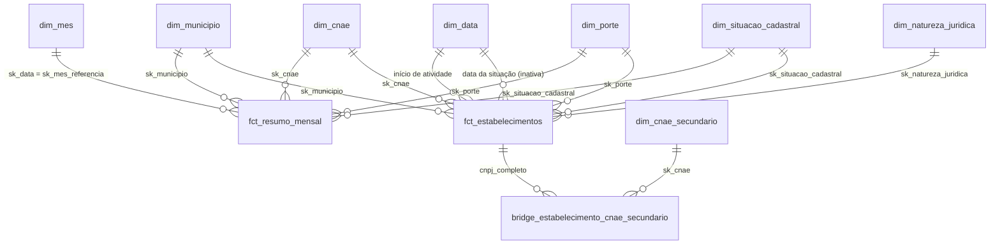

# Guia Power BI

Este guia mostra como montar um painel no Power BI sobre o modelo estrela publicado em `gold/`
(ADR-0013). Tudo aqui é **adição** ao projeto original (ADR-0006): o original só entregava tabelas
analíticas, sem modelo para BI.

> **Resumo.** Use `fct_resumo_mensal` (agregada, com histórico mensal) em modo **Import**, carregando
> os **últimos 24 meses** (ver §2). Use `fct_estabelecimentos` (um registro por CNPJ, ~65 milhões de
> linhas no mês real) só em consultas detalhadas via DuckDB, não no Power BI Import.
>
> **Tamanho do resumo (medido em fev/2025, 64,5 M estabelecimentos):** 5,44 M linhas por mês e 55 MB de Parquet por partição (64,5 M estabelecimentos; 5.571 municípios e 1.342 subclasses; build de `+fct_resumo_mensal +dim_data` em 140 s, pico de RSS 13,9 GB com `DUCKDB_THREADS=4`). O grão anterior tinha 22,0 M linhas (202 MB). Mesmo assim, 24 meses somam ~130 M linhas: para o Import use os **últimos 24 meses**, e para séries mais longas filtre município/CNAE na consulta (ODBC com SQL nativo) ou agregue por classe.

## Como o Power BI acessa os dados

Há três caminhos para chegar aos marts. Todos partem do mesmo `gold/` (o contrato do projeto); o que muda é
o conector, o modo de consulta e a operação de atualização.

| | 1. Parquet em `gold/` | 2. Arquivo DuckDB local | 3. MotherDuck (após `rfb publicar`) |
|---|---|---|---|
| **Conector no Power BI** | Parquet (um arquivo) ou Pasta + `Parquet.Document` (série mensal) | ODBC (driver do DuckDB); conector Power Query customizado é legado | **PostgreSQL** (nativo), pelo Postgres endpoint |
| **Instalação** | nenhuma | driver ODBC do DuckDB (Windows) + DSN | nenhuma (precisa do token e do host `pg.<região>-aws.motherduck.com`) |
| **Modo** | Import | Import | Import **ou** DirectQuery |
| **O que lê** | os `*.parquet` | `warehouse.duckdb`, com **views** sobre o gold | tabelas copiadas do gold (`rfb publicar`) |
| **Atualização no Service** | gateway para arquivos locais; ou arquivos online (Azure Blob/ADLS Gen2) | gateway (+ driver ODBC instalado na máquina do gateway) | On-premises Data Gateway (Import) ou consulta ao vivo (DirectQuery, via gateway) |
| **Trava de arquivo** | não (Parquet é só leitura) | **sim**: um processo gravando bloqueia os demais (veja abaixo) | não |
| **Custo/dependência** | zero | zero | conta MotherDuck (limites e preço do plano do usuário) |

### 1. Parquet em `gold/` (mais simples; recomendado)

1. *Obter dados → Mais… → Parquet* e informe o caminho de um `*.parquet` (ex.:
   `dados\gold\dim_municipio.parquet`). Repita para cada dimensão e para a fato escolhida. O conector
   Parquet suporta **só Import**.
2. **Série mensal particionada** (`fct_resumo_mensal/mes_referencia=AAAA-MM/*.parquet`): use *Obter dados →
   Pasta*, aponte para `gold\fct_resumo_mensal`, filtre as colunas `Folder Path`/`Name` para os meses
   desejados e expanda os arquivos (`data_0.parquet` de cada pasta `mes_referencia=AAAA-MM`) com
   `Parquet.Document`. Em M:

   ```m
   let
     Origem = Folder.Files("D:\dados\gold\fct_resumo_mensal"),
     Parquets = Table.SelectRows(Origem, each [Extension] = ".parquet"),
     Dados = Table.AddColumn(Parquets, "t", each Parquet.Document([Content])),
     Resumo = Table.Combine(Dados[t])
   in
     Resumo
   ```

   **A coluna da partição não está dentro dos arquivos** (o DuckDB grava `mes_referencia` só no nome da
   pasta): use `sk_mes_referencia` (já na fato, `yyyymm01`) para o relacionamento e os filtros; se precisar
   do texto `AAAA-MM`, extraia-o de `[Folder Path]` ou use `dim_mes[ano_mes]`.
3. Atualização no Service: arquivos locais exigem **On-premises Data Gateway** (o conector Parquet pede o
   gateway para arquivo local). Enviar o Parquet ao OneDrive/SharePoint **não** é o caminho documentado: a
   "OneDrive refresh" da Microsoft cobre .pbix, .xlsx e .csv, e o conector Parquet só lê sistema de
   arquivos local, Azure Blob e ADLS Gen2 (*a confirmar* se a Pasta do SharePoint aceita Parquet).
4. Com o gold em S3 (ADR-0007), baixe o `gold/` (por exemplo com `aws s3 sync`) ou use o conector
   Amazon S3/Parquet do seu gateway.

### 2. Arquivo DuckDB local (`warehouse.duckdb`)

1. Instale o driver ODBC do DuckDB no Windows (`odbc_install.exe`, com administrador) e crie um DSN em
   `odbcad32.exe` apontando para o caminho do `warehouse.duckdb`.
2. No Power BI: *Obter dados → ODBC*, escolha o DSN e selecione as views (`fct_resumo_mensal` etc.).
   Modo **Import**. O conector Power Query customizado para DuckDB é considerado **legado** pela MotherDuck;
   não o recomendamos.
3. **Travas.** O DuckDB só admite **um processo com o arquivo aberto em leitura e escrita** (vários só em
   modo somente leitura). Com o Power BI conectado, o `dbt build` pode falhar ao abrir o arquivo, e o
   Power BI não conecta enquanto o `dbt build` roda. Mitigações: **copie** `warehouse.duckdb` para outro
   caminho e conecte à cópia, ou prefira o caminho 1 (Parquet). Abrir em somente leitura (opção
   `access_mode=READ_ONLY` do DuckDB; *a confirmar* a sintaxe no DSN) evita conflito entre leitores, mas
   não com o `dbt build`, que escreve.
4. As views apontam para os Parquet de `gold/` (a visão `fct_resumo_mensal` lê todas as partições): a
   máquina que lê precisa enxergar esses caminhos. O `warehouse.duckdb` é descartável (ADR-0001): se ele
   sumir, rode o `dbt build` de novo; as partições Parquet continuam em `gold/`.
5. Alternativa sem o arquivo do warehouse (e sem trava): DSN com banco `:memory:` e SQL nativo sobre o
   Parquet, por exemplo:

   ```sql
   select * from read_parquet('D:/dados/gold/fct_resumo_mensal/*/*.parquet', hive_partitioning = true)
   ```

### 3. MotherDuck (após `rfb publicar`)

1. Publique o gold (ver README, `make publicar`; precisa de `MOTHERDUCK_TOKEN` e `MOTHERDUCK_BANCO`).
2. No Power BI Desktop: *Obter dados → Banco de dados PostgreSQL*. Servidor: `pg.<região>-aws.motherduck.com`
   (sua região consta nas configurações do Postgres endpoint do MotherDuck); Banco: o nome do banco publicado;
   modo **Import** (instantâneo em memória, atualizado por agendamento) **ou DirectQuery** (consulta ao vivo,
   para dados sempre atuais). Credenciais (Básica): usuário `postgres`, senha = **token** do MotherDuck.
3. No Power BI Service, instale o **On-premises Data Gateway** (modo padrão, não pessoal) e crie a conexão
   PostgreSQL com o mesmo servidor e banco (idênticos ao .pbix, inclusive maiúsculas/minúsculas),
   autenticação Básica, conexão criptografada. Import: agendamento de atualização no modelo semântico;
   DirectQuery: sem atualização, consulta ao vivo pelo gateway.

### Qual escolher

| Cenário | Recomendação |
|---|---|
| Exploração local, uma pessoa, Windows | **1 (Parquet)**: sem driver, sem travas |
| Relatório compartilhado, atualização mensal agendada | **3 (MotherDuck, Import)** ou 1 com gateway; o mês muda uma vez por mês |
| Dados sempre atuais, vários consumidores | **3 (MotherDuck, DirectQuery)**, sobre `fct_resumo_mensal` |
| Fato detalhada (`fct_estabelecimentos`, ~65 M de linhas) | **Não** no Import: use `fct_resumo_mensal` (últimos 24 meses); detalhe só por consulta SQL ou DirectQuery filtrado |
| Precisa do SQL do DuckDB (views, consultas nativas) | 2 (ODBC), sobre **cópia** do arquivo |

### Fontes oficiais

- [MotherDuck — Power BI Desktop](https://motherduck.com/docs/integrations/bi-tools/powerbi/powerbi-desktop/) e
  [Power BI Service](https://motherduck.com/docs/integrations/bi-tools/powerbi/powerbi-service/) (conector
  PostgreSQL, endpoint, Import/DirectQuery, gateway; conector DuckDB customizado descontinuado).
- [DuckDB — driver ODBC no Windows](https://duckdb.org/docs/current/clients/odbc/windows.html) e
  [concorrência](https://duckdb.org/docs/current/connect/concurrency.html) (um processo de escrita; vários
  só de leitura).
- [Power Query — conector Parquet](https://learn.microsoft.com/en-us/power-query/connectors/parquet)
  (Import; local exige gateway), [atualização de dados](https://learn.microsoft.com/en-us/power-bi/connect-data/refresh-data)
  e [On-premises data gateway](https://learn.microsoft.com/en-us/data-integration/gateway/service-gateway-onprem).
- Decisão do projeto: [ADR-0016](adr/0016-publicacao-motherduck.md).

## 1. O modelo estrela



`dim_mes` e `dim_cnae_secundario` não existem em `gold/`: são **cópias** (referência no Power Query) de
`dim_data` e `dim_cnae` criadas no modelo, pelos motivos das §1 (relacionamentos) e §3. A natureza
jurídica **não** está no resumo mensal (emenda R3 do ADR-0013): use `fct_estabelecimentos` (via DuckDB)
ou outra consulta detalhada para essa quebra, e `mart_sobrevivencia_coorte` para o ano de início.

Convenções (valem para todas as dimensões):

- Chaves `sk_*` **inteiras** e determinísticas (não mudam entre execuções).
- Membro **`-1` = "NÃO INFORMADO"** em toda dimensão: a fato nunca tem chave nula nem perde linhas.
- `dim_data` é um calendário diário de **1900-01-01** até `data_referencia` (ou a maior data observada),
  com `sk_data = yyyymmdd`. O **mês de referência** de `fct_resumo_mensal` é o **primeiro dia do mês**:
  `sk_mes_referencia = yyyymm01` (ex.: `20260901`), que casa com `dim_data[sk_data]`.
- `dim_data` tem dois membros especiais **com data própria**, para que a coluna `data` não tenha vazios:
  `-1` NÃO INFORMADO (data nula) = `1899-12-31` e `-2` DATA INVÁLIDA (data anterior a 1900 na RFB,
  ex.: 1194-08-15) = `1899-12-30`. `ano`, `mes` etc. são nulos neles. Só `fct_estabelecimentos` aponta
  para `-2`.
- Hierarquias prontas em colunas: `dim_municipio` (nome_regiao → sigla_uf → nome_mesorregiao →
  nome_microrregiao → nome_municipio; e nome_regiao_intermediaria → nome_regiao_imediata) e `dim_cnae`
  (descricao_secao → descricao_divisao → descricao_grupo → descricao_classe → descricao_subclasse).
  No Power BI, crie as hierarquias arrastando uma coluna sobre a outra no painel de Campos.

### Relacionamentos

Todos **um-para-muitos (1:\*)**, filtro em **direção única** (da dimensão para a fato). Não use
direção "ambos": ela cria ambiguidade e deixa o modelo lento.

| De (lado 1) | Para (lado \*) | Ativo |
|---|---|---|
| `dim_mes[sk_data]` (cópia de `dim_data`) | `fct_resumo_mensal[sk_mes_referencia]` | sim |
| `dim_municipio[sk_municipio]` | `fct_resumo_mensal[sk_municipio]` | sim |
| `dim_cnae[sk_cnae]` | `fct_resumo_mensal[sk_cnae]` | sim |
| `dim_porte[sk_porte]` | `fct_resumo_mensal[sk_porte]` | sim |
| `dim_situacao_cadastral[sk_situacao_cadastral]` | `fct_resumo_mensal[sk_situacao_cadastral]` | sim |
| `dim_data[sk_data]` | `fct_estabelecimentos[sk_data_inicio_atividade]` | sim |
| `dim_data[sk_data]` | `fct_estabelecimentos[sk_data_situacao]` | **não** (papel secundário; ative com `USERELATIONSHIP`) |
| demais `dim_*[sk_*]` | `fct_estabelecimentos[sk_*]` | sim |
| `fct_estabelecimentos[cnpj_completo]` | `bridge_estabelecimento_cnae_secundario[cnpj_completo]` | opcional |
| `dim_cnae_secundario[sk_cnae]` (cópia de `dim_cnae`) | `bridge_estabelecimento_cnae_secundario[sk_cnae]` | opcional |
| `dim_municipio[sk_municipio]` | `bridge_municipio_vizinho[sk_municipio]` | opcional (**incremento enriquecimento BD**) |
| `dim_municipio_vizinho[sk_municipio]` (cópia de `dim_municipio`) | `bridge_municipio_vizinho[sk_municipio_vizinho]` | opcional (**incremento enriquecimento BD**) |

- **Bridge sem caminho ambíguo.** Se `dim_cnae` se relacionasse com a bridge e com a fato, haveria dois
  caminhos entre `dim_cnae` e a bridge (direto e via `fct_estabelecimentos`) e o Power BI desativaria um
  deles. Por isso a bridge se liga a uma **cópia** (`dim_cnae_secundario`) e **não** tem relação direta
  ativa com `dim_cnae`. Para filtrar estabelecimentos por CNAE secundário, use `dim_cnae_secundario`.
- **`dim_mes` para o resumo.** `dim_data` filtra o início de atividade da fato detalhada e o mês de
  referência do resumo com significados diferentes (uma segmentação em `ano_mes` mudaria de sentido entre
  as fatos). Crie `dim_mes` como cópia (referência) de `dim_data` e ligue-a só ao resumo; `dim_data`
  fica para `fct_estabelecimentos`.
- **Tabela de datas.** `dim_data` e `dim_mes` agora podem ser marcadas como **tabela de datas** (coluna
  `data`: única, sem vazios, contínua; `-1` e `-2` têm datas sentinela contíguas). Sem a marcação,
  `DATEADD` não funciona.
- Esconda as colunas `sk_*` das fatos.

## 2. Atualização incremental por mês

Cada mês novo grava **uma partição nova** e nunca reescreve as antigas (ADR-0012), então só o mês novo
muda. No Power BI:

1. Crie os parâmetros `RangeStart` e `RangeEnd` (tipo Data/Hora) e filtre `fct_resumo_mensal` por uma coluna de
   data derivada do mês. `RangeStart`/`RangeEnd` são Data/Hora, e o M não compara Date com DateTime:
   `DateTime.From(Date.FromText(Text.From([sk_mes_referencia]), [Format="yyyyMMdd"]))`.
2. Defina a política: **armazenar 24 meses, atualizar o último 1 mês**. O Power BI Service passa a
   recarregar só a partição mais recente.
3. Com a fonte em pasta o filtro não é empurrado ao arquivo (não há *query folding*): o ganho está em não
   reprocessar os meses fechados no modelo. Se a série ficar grande, use o ODBC com SQL nativo filtrando
   `mes_referencia`.
4. Reprocessar um mês antigo (`--vars mes_referencia`) substitui só a partição dele; faça um refresh
   completo do modelo para refletir a correção.

## 3. Medidas DAX sugeridas

As medidas usam as tabelas e colunas reais do modelo. Crie-as numa tabela `Medidas`.

```dax
Qtd Estabelecimentos = SUM ( fct_resumo_mensal[qtd_estabelecimentos] )

Qtd Ativos = SUM ( fct_resumo_mensal[qtd_ativos] )

% Ativos = DIVIDE ( [Qtd Ativos], [Qtd Estabelecimentos] )

Idade Média (anos) =
DIVIDE ( SUM ( fct_resumo_mensal[soma_idade_anos] ), [Qtd Ativos] )

-- Capital social é da EMPRESA e se repete por estabelecimento: o resumo soma só as matrizes
-- (uma por empresa), então estas medidas contam cada empresa uma vez.
Capital Social Total (R$) = SUM ( fct_resumo_mensal[soma_capital_social_matrizes] )

Qtd Matrizes = SUM ( fct_resumo_mensal[qtd_matrizes] )

Capital Social Médio (R$) =
DIVIDE ( [Capital Social Total (R$)], [Qtd Matrizes] )

Qtd Ativos MEI =
CALCULATE ( [Qtd Ativos], fct_resumo_mensal[opcao_mei] = TRUE () )

% MEI entre Ativos = DIVIDE ( [Qtd Ativos MEI], [Qtd Ativos] )

-- A população repete por linha da fato: some uma vez por município.
Ativos por 10 mil hab. =
VAR Populacao =
    SUMX ( VALUES ( dim_municipio[sk_municipio] ), CALCULATE ( MAX ( dim_municipio[populacao] ) ) )
RETURN
    DIVIDE ( [Qtd Ativos] * 10000, Populacao )

-- Incremento enriquecimento BD (ADR-0015): atributos do Censo 2022 em dim_municipio. Os domicílios
-- repetem por linha da fato: some uma vez por município, como na população.
Ativos por mil domicílios =
VAR Domicilios =
    SUMX ( VALUES ( dim_municipio[sk_municipio] ), CALCULATE ( MAX ( dim_municipio[domicilios_2022] ) ) )
RETURN
    DIVIDE ( [Qtd Ativos] * 1000, Domicilios )

-- Mês anterior: dim_mes marcada como tabela de datas; a fato só tem o dia 1 de cada mês.
Qtd Ativos Mês Anterior =
CALCULATE ( [Qtd Ativos], DATEADD ( dim_mes[data], -1, MONTH ) )

Variação Mensal de Ativos = [Qtd Ativos] - [Qtd Ativos Mês Anterior]

Variação Mensal de Ativos (%) = DIVIDE ( [Variação Mensal de Ativos], [Qtd Ativos Mês Anterior] )

-- Em visuais por mês, o total sem filtro de mês soma todos os meses: filtre pelo mês mais recente.
-- O ALL ignora os filtros do visual, então o mês é o último de TODA a fato (e não o último
-- da combinação de município/CNAE em cada célula, que mostraria um mês antigo se ela sumiu).
Qtd Ativos Mês Mais Recente =
VAR UltimoMes = CALCULATE ( MAX ( fct_resumo_mensal[sk_mes_referencia] ), ALL ( fct_resumo_mensal ) )
RETURN
    CALCULATE ( [Qtd Ativos], dim_mes[sk_data] = UltimoMes )

-- Requer importar mart_sobrevivencia_coorte (tabela analítica, fora da estrela).
Taxa de Sobrevivência 3a =
DIVIDE (
    SUM ( mart_sobrevivencia_coorte[sobreviventes_3a] ),
    SUM ( mart_sobrevivencia_coorte[elegiveis_3a] )
)
```

Cuidados:

- **Não some meses.** `fct_resumo_mensal` é uma fotografia por mês: somar `Qtd Ativos` de vários meses
  conta o mesmo estabelecimento várias vezes. Em cartões, filtre um mês (segmentação em `dim_mes[ano_mes]`)
  ou use `Qtd Ativos Mês Mais Recente`.
- **Colunas novas em `dim_municipio` (incremento enriquecimento BD, ADR-0015):** `populacao_censo_2022`,
  `domicilios_2022`, `area_km2`, `densidade_hab_km2`, `taxa_alfabetizacao` (fração 0–1), `idade_mediana`,
  `indice_envelhecimento`, `razao_sexo` e `nome_regiao_metropolitana` (`NÃO PERTENCE` fora de região
  metropolitana; `NÃO INFORMADO` no membro `-1`). Município sem Censo tem os atributos vazios. Para a
  área de mercado importe `mart_concorrencia_area_mercado` (relaciona-se por `sk_municipio`/`sk_cnae`); ela inclui os
  vazios de mercado (município sem o CNAE, mas com ativo nos vizinhos ou na região metropolitana):
  `tem_estabelecimento_local` = false, ativos/inativos locais 0. Filtre por essa coluna para ver só
  onde já há concorrente ou só os vazios.
- A `Idade Média` considera só ativos (`soma_idade_anos` é a soma da idade dos ativos).
- O resumo **não** tem ano de início nem natureza jurídica. Para coorte use `mart_sobrevivencia_coorte`
  (ou `fct_estabelecimentos` via DuckDB); em `fct_estabelecimentos`, `sk_data_inicio_atividade = -1` é data
  ausente e `-2` é data inválida (anterior a 1900): exclua ambos em análises de coorte.
- **"Ativa" no cadastro ≠ em operação (R3-19).** "Ativa" é a situação cadastral 02 da RFB: empresas sem
  atividade seguem ATIVAS até serem declaradas INAPTAS ou baixadas. Por isso `Qtd Ativos`, a densidade de
  concorrência e, sobretudo, as taxas de `mart_sobrevivencia_coorte` saem mais otimistas que as de fontes que
  medem operação efetiva (ex.: IBGE, Demografia das Empresas). Registre essa ressalva nos relatórios.
- Os marts de `analytics` (`mart_concorrencia_municipio`, `mart_dinamica_mercado`, `mart_sobrevivencia_coorte`,
  `mart_fornecedores_proximos`) expõem `sk_municipio`/`sk_cnae` (e `sk_porte` na sobrevivência), então se
  relacionam com `dim_municipio`/`dim_cnae` pelas mesmas chaves da estrela (R3-20).
- `fct_estabelecimentos[capital_social]` é atributo da empresa repetido por estabelecimento: não some por
  estabelecimento; filtre `eh_matriz` (ou use o resumo).
- **Grafia dos municípios (P18).** `bh_empresas`/`agg_empresas` guardam o município em MAIÚSCULAS
  (herdado do SQL original, que a paridade exige), enquanto `dim_municipio` e os marts de analytics usam a
  grafia da Base dos Dados ("Fundão"). Para cruzar uma tabela com a outra use `upper(nome_municipio)` **e**
  `sigla_uf` (ou, melhor, `sk_municipio` = código IBGE) em vez de comparar o texto como veio.

## 4. Exposure no dbt

O arquivo `transform/models/marts/core/_core__exposures.yml` declara um `exposure` do tipo `dashboard`
que depende de todas as dimensões e fatos da estrela. Ele aparece no `dbt docs` e no grafo de linhagem;
`dbt ls --resource-type exposure` lista a exposição.
