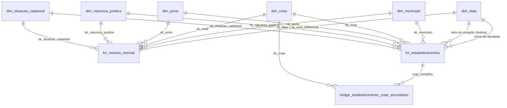

# Guia Power BI

Este guia mostra como montar um painel no Power BI sobre o modelo estrela publicado em `gold/`
(ADR-0013). Tudo aqui é **adição** ao projeto original (ADR-0006): o original só entregava tabelas
analíticas, sem modelo para BI.

> **Resumo.** Use `fct_resumo_mensal` (pequena, com histórico mensal) em modo **Import**. Use
> `fct_estabelecimentos` (um registro por CNPJ, ~65 milhões de linhas no mês real) só em consultas
> detalhadas via DuckDB, não no Power BI Import.

## 1. O modelo estrela



Convenções (valem para todas as dimensões):

- Chaves `sk_*` **inteiras** e determinísticas (não mudam entre execuções).
- Membro **`-1` = "NÃO INFORMADO"** em toda dimensão: a fato nunca tem chave nula nem perde linhas.
- `dim_data` é um calendário diário com `sk_data = yyyymmdd`. O **mês de referência** de
  `fct_resumo_mensal` é o **primeiro dia do mês**: `sk_mes_referencia = yyyymm01` (ex.: `20260901`),
  que casa com `dim_data[sk_data]`.
- Hierarquias prontas em colunas: `dim_municipio` (nome_regiao → sigla_uf → nome_mesorregiao →
  nome_microrregiao → nome_municipio; e nome_regiao_intermediaria → nome_regiao_imediata) e `dim_cnae`
  (descricao_secao → descricao_divisao → descricao_grupo → descricao_classe → descricao_subclasse).
  No Power BI, crie as hierarquias arrastando uma coluna sobre a outra no painel de Campos.

### Relacionamentos

Todos **um-para-muitos (1:\*)**, filtro em **direção única** (da dimensão para a fato). Não use
direção "ambos": ela cria ambiguidade e deixa o modelo lento.

| De (lado 1) | Para (lado \*) | Ativo |
|---|---|---|
| `dim_data[sk_data]` | `fct_resumo_mensal[sk_mes_referencia]` | sim |
| `dim_municipio[sk_municipio]` | `fct_resumo_mensal[sk_municipio]` | sim |
| `dim_cnae[sk_cnae]` | `fct_resumo_mensal[sk_cnae]` | sim |
| `dim_porte[sk_porte]` | `fct_resumo_mensal[sk_porte]` | sim |
| `dim_natureza_juridica[sk_natureza_juridica]` | `fct_resumo_mensal[sk_natureza_juridica]` | sim |
| `dim_situacao_cadastral[sk_situacao_cadastral]` | `fct_resumo_mensal[sk_situacao_cadastral]` | sim |
| `dim_data[sk_data]` | `fct_estabelecimentos[sk_data_inicio_atividade]` | sim |
| `dim_data[sk_data]` | `fct_estabelecimentos[sk_data_situacao]` | **não** (papel secundário; ative com `USERELATIONSHIP`) |
| demais `dim_*[sk_*]` | `fct_estabelecimentos[sk_*]` | sim |
| `fct_estabelecimentos[cnpj_completo]` | `bridge_estabelecimento_cnae_secundario[cnpj_completo]` | opcional |
| `dim_cnae[sk_cnae]` | `bridge_estabelecimento_cnae_secundario[sk_cnae]` | opcional (muitos-para-muitos) |

Marque `dim_data` como **tabela de datas** (coluna `data`). Esconda as colunas `sk_*` das fatos.

## 2. Conexão

### 2.1 Conector Parquet do Power Query (recomendado)

1. **Obter dados → Mais… → Parquet** para as dimensões (`gold/dim_*.parquet`).
2. Para a série mensal, use **Obter dados → Pasta** em `gold/fct_resumo_mensal/` e expanda os arquivos
   `data_0.parquet` de todas as pastas `mes_referencia=YYYY-MM`. Em M:

   ```m
   let
     Origem = Folder.Files("D:\dados\gold\fct_resumo_mensal"),
     Parquets = Table.SelectRows(Origem, each [Extension] = ".parquet"),
     Dados = Table.AddColumn(Parquets, "t", each Parquet.Document([Content])),
     Resumo = Table.Combine(Dados[t])
   in
     Resumo
   ```

   `mes_referencia` e `sk_mes_referencia` estão dentro do arquivo, então não é preciso ler o nome da pasta.
3. Para dados em S3 (ADR-0007), baixe o `gold/` (por exemplo com `aws s3 sync`) ou use o conector
   Amazon S3/Parquet do seu gateway.

### 2.2 ODBC do DuckDB

1. Instale o driver ODBC do DuckDB (`duckdb_odbc`) e crie um DSN de sistema apontando para
   `RAIZ_DADOS/warehouse.duckdb` com `access_mode=read_only` (a visão `fct_resumo_mensal` lê todas as
   partições). O `warehouse.duckdb` é descartável (ADR-0001): se ele sumir, rode o `dbt build` de novo;
   as partições Parquet continuam em `gold/`.
2. No Power BI: **Obter dados → ODBC**, escolha o DSN e selecione as tabelas. Ou, com o banco `:memory:`,
   passe um SQL nativo:

   ```sql
   select * from read_parquet('D:/dados/gold/fct_resumo_mensal/*/*.parquet', hive_partitioning = true)
   ```

## 3. Atualização incremental por mês

Cada mês novo grava **uma partição nova** e nunca reescreve as antigas (ADR-0012), então só o mês novo
muda. No Power BI:

1. Crie os parâmetros `RangeStart` e `RangeEnd` (tipo Data/Hora) e filtre `fct_resumo_mensal` por uma coluna de
   data derivada do mês: `Date.FromText(Text.From([sk_mes_referencia]), [Format="yyyyMMdd"])`.
2. Defina a política: **armazenar 60 meses, atualizar o último 1 mês**. O Power BI Service passa a
   recarregar só a partição mais recente.
3. Com a fonte em pasta o filtro não é empurrado ao arquivo (não há *query folding*): o ganho está em não
   reprocessar os meses fechados no modelo. Se a série ficar grande, use o ODBC com SQL nativo filtrando
   `mes_referencia`.
4. Reprocessar um mês antigo (`--vars mes_referencia`) substitui só a partição dele; faça um refresh
   completo do modelo para refletir a correção.

## 4. Medidas DAX sugeridas

As medidas usam as tabelas e colunas reais do modelo. Crie-as numa tabela `Medidas`.

```dax
Qtd Estabelecimentos = SUM ( fct_resumo_mensal[qtd_estabelecimentos] )

Qtd Ativos = SUM ( fct_resumo_mensal[qtd_ativos] )

% Ativos = DIVIDE ( [Qtd Ativos], [Qtd Estabelecimentos] )

Idade Média (anos) =
DIVIDE ( SUM ( fct_resumo_mensal[soma_idade_anos] ), [Qtd Ativos] )

Capital Social Total (R$) = SUM ( fct_resumo_mensal[soma_capital_social] )

Capital Social Médio (R$) =
DIVIDE ( [Capital Social Total (R$)], [Qtd Estabelecimentos] )

Qtd Ativos MEI =
CALCULATE ( [Qtd Ativos], fct_resumo_mensal[opcao_mei] = TRUE () )

% MEI entre Ativos = DIVIDE ( [Qtd Ativos MEI], [Qtd Ativos] )

-- A população repete por linha da fato: some uma vez por município.
Ativos por 10 mil hab. =
VAR Populacao =
    SUMX ( VALUES ( dim_municipio[sk_municipio] ), CALCULATE ( MAX ( dim_municipio[populacao] ) ) )
RETURN
    DIVIDE ( [Qtd Ativos] * 10000, Populacao )

-- Mês anterior: dim_data marcada como tabela de datas; a fato só tem o dia 1 de cada mês.
Qtd Ativos Mês Anterior =
CALCULATE ( [Qtd Ativos], DATEADD ( dim_data[data], -1, MONTH ) )

Variação Mensal de Ativos = [Qtd Ativos] - [Qtd Ativos Mês Anterior]

Variação Mensal de Ativos (%) = DIVIDE ( [Variação Mensal de Ativos], [Qtd Ativos Mês Anterior] )

-- Em visuais por mês, o total sem filtro de mês soma todos os meses: filtre pelo mês mais recente.
Qtd Ativos Mês Mais Recente =
CALCULATE ( [Qtd Ativos], dim_data[sk_data] = MAX ( fct_resumo_mensal[sk_mes_referencia] ) )

-- Requer importar mart_sobrevivencia_coorte (tabela analítica, fora da estrela).
Taxa de Sobrevivência 3a =
DIVIDE (
    SUM ( mart_sobrevivencia_coorte[sobreviventes_3a] ),
    SUM ( mart_sobrevivencia_coorte[elegiveis_3a] )
)
```

Cuidados:

- **Não some meses.** `fct_resumo_mensal` é uma fotografia por mês: somar `Qtd Ativos` de vários meses
  conta o mesmo estabelecimento várias vezes. Em cartões, filtre um mês (segmentação em `dim_data[ano_mes]`)
  ou use `Qtd Ativos Mês Mais Recente`.
- A `Idade Média` considera só ativos (`soma_idade_anos` é a soma da idade dos ativos).
- `ano_inicio_atividade = -1` significa data de início ausente; exclua-o em análises de coorte.

## 5. Exposure no dbt

O arquivo `transform/models/marts/core/_core__exposures.yml` declara um `exposure` do tipo `dashboard`
que depende de todas as dimensões e fatos da estrela. Ele aparece no `dbt docs` e no grafo de linhagem;
`dbt ls --resource-type exposure` lista a exposição.
