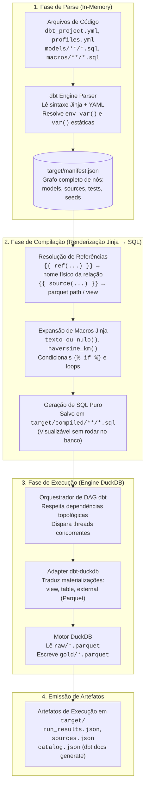
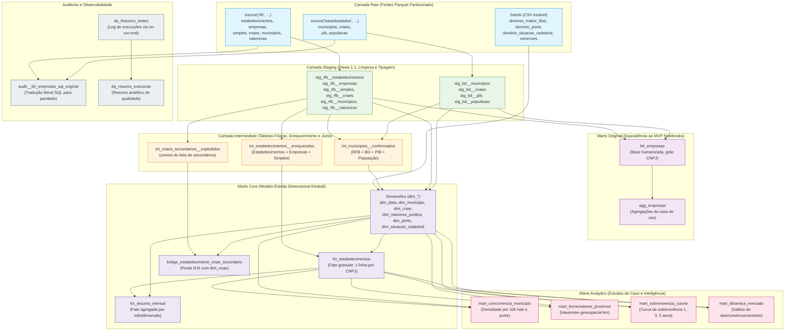

# Guia dbt — Parte 1: Fundamentos

> **Público-alvo:** engenheiro(a) de dados aprendendo dbt (ver persona em [PRODUCT.md](../../PRODUCT.md)).
> Todo exemplo usa nomes e arquivos **deste projeto** (pipeline RFB/CNPJ em dbt + DuckDB) — quando indicado
> por "desenho", o exemplo corresponde ao projeto conforme [ARCHITECTURE.md](../../ARCHITECTURE.md) (o diretório
> `transform/` é implementado ao longo deste port).
>
> **Parte 1 de 5** — ver também `02-fluxo-e-testes.md`, `03-qualidade-antes-e-depois.md`, `04-bibliotecas-e-tecnicas.md` e `05-boas-praticas-e-usos.md`.

---

## Sumário

- [1. O que é o dbt](#1-o-que-é-o-dbt)
- [2. Como funciona](#2-como-funciona)
- [3. Conceitos](#3-conceitos)
- [4. Estrutura de um projeto típico](#4-estrutura-de-um-projeto-típico)
- [5. Como executar comandos](#5-como-executar-comandos)
- [6. Armadilhas comuns no dbt](#6-armadilhas-comuns-no-dbt)
- [7. Leituras recomendadas](#7-leituras-recomendadas)

---

## 1. O que é o dbt

O **dbt** (data build tool) é a ferramenta de transformação do ELT: é o **"T"**. Ele pega dados que já estão
acessíveis ao seu motor de consulta e os transforma de forma **versionada, testável e documentada** — com a
mesma disciplina de software (git, revisão, CI) que você usa para código.

- O que ele **faz**: lê um projeto de transformações escritas em **SQL + Jinja**, monta um grafo de
  dependências (DAG), compila o SQL, executa no warehouse/a plataforma de dados e registra tudo em artefatos.
- O que ele **NÃO faz**: não extrai dados de fontes externas e não os carrega — **não é um orquestrador de
  ingestão** nem um conector. Esse EL tem de vir de outra ferramenta.

Neste projeto o EL é **Python** (`src/rfb_pipeline/`): baixa os zips do WebDAV da RFB e os `csv.gz` da Base
dos Dados, converte tudo para Parquet em `raw/` e só então o dbt entra em cena. Essa divisão é uma decisão
explícita de arquitetura (ver [ADR-0002](../../docs/adr/0002-ingestao-python-raw-varchar.md)).

### dbt Core × dbt Cloud (dbt platform) × dbt Fusion engine

| | O que é | Onde roda | Custo |
|---|---|---|---|
| **dbt Core** | Software open-source (CLI `dbt`), escrito em Python + Jinja | Sua máquina / seu CI | Grátis |
| **dbt Cloud** (hoje "dbt platform") | Produto SaaS: Core + UI, agendamento, semântica, governança, API | Nuvem gerenciada dbt | assinatura |
| **dbt Fusion engine** | Novo motor em **Rust** para dbt, com compreensão real de SQL | Substitui o Core sob o mesmo authoring layer | dbt v2 (GA na platform p/ Snowflake, preview nos demais) |

Detalhes honestos sobre o Fusion: anunciado em 2025 como a nova geração do motor do dbt ("dbt v2"),
reescrito do zero em Rust (tecnologia da [SDF](https://www.getdbt.com/blog/dbt-labs-acquires-sdf-labs)).
Ele é GA (General Availability) na dbt platform para Snowflake e está em preview nos demais adaptadores,
prometendo parsing até 30× mais rápido e compilação ~2× mais rápida com o mesmo formato de projeto
(SQL/Jinja/YAML) do Core. Para acompanhar o status atual e detalhes de suporte por adaptador, consulte
a documentação oficial: [About dbt Fusion](https://docs.getdbt.com/docs/fusion/about-fusion) e as
[Fusion Releases](https://docs.getdbt.com/docs/dbt-versions/fusion-releases) (ver também links na [seção 7](#7-leituras-recomendadas)).
Este projeto usa **dbt Core 1.12** + adaptador **dbt-duckdb 1.11** (verificado em `dbt --version`).

### Por que o dbt e não só Python/Pandas?

O que o dbt agrega sobre scripts ad hoc:

1. **DAG implícito**: `ref()`/`source()` constroem o grafo; `dbt compile`/`run` executam na ordem certa.
2. **Testes de dados**: unicidade, não-nulos, relacionamentos, domínios — falhas falham o build.
3. **Documentação viva**: `dbt docs` gera um site com linhagem ligada ao código.
4. **Incrementalidade**: modelos só recalculam o que mudou (`materialized='incremental'`).
5. **Versionamento**: SQL é revisável como código; o estado está no git, não no banco.
6. **Determinismo e idempotência**: reexecutar um modelo é seguro.

---

## 2. Como funciona

### 2.1 O ciclo Parse → Compile → Execute

O dbt opera em fases bem delimitadas. Entender essa separação evita confusões comuns (por exemplo: por que o dbt não consegue usar dados retornados por uma consulta para decidir dinamicamente se uma coluna existe durante a compilação).



Passo a passo (o que acontece quando você roda `dbt run`, `dbt test`, `dbt build`, …):

1. **Projeto e descoberta**: o dbt lê todo o diretório `transform/` a partir de `dbt_project.yml`. As credenciais e opções de conexão vêm de `profiles.yml` (neste projeto, com saídas para `ci`, `dev` e `s3`).
2. **Parse**: os arquivos `.sql`, `.yml`, `.csv` (seeds) e macros são lidos e validados estruturalmente. O dbt constrói o **manifesto do projeto** (`target/manifest.json`). Comandos como `dbt parse` e `dbt ls` operam estritamente nesta etapa sem tocar nos dados. Se `partial_parse.msgpack` existir, apenas arquivos modificados desde a última execução são relidos.
3. **Compilação**: **o Jinja é renderizado para SQL puro e executável**. Chamadas a `{{ ref('bh_empresas') }}` viram `main.bh_empresas` ou caminhos externos; macros customizadas (`texto_ou_nulo`, `data_rfb`) expandem seus blocos `CASE WHEN`; blocos condicionais são avaliados. O SQL resultante é gravado em `target/compiled/`.
4. **DAG (Grafo Acíclico Dirigido)**: as dependências topológicas são construídas a partir de `ref()` e `source()`. O dbt **não inspeciona a sintaxe SQL** para adivinhar dependências; são unicamente as macros `ref()` e `source()` que criam as arestas do grafo.
5. **Execução**: o adaptador `dbt-duckdb` abre a conexão com o banco DuckDB (conforme `path` no profile) e despacha as consultas DDL/DML. Modelos `view` viram `CREATE VIEW ...`, `table` viram `CREATE TABLE ... AS SELECT ...`, e `external` geram arquivos Parquet diretamente em `gold/` usando a instrução `COPY (...) TO '...' (FORMAT PARQUET)` nativa do DuckDB.
6. **Artefatos gerados**:
   - `target/manifest.json` — catálogo completo de nós, colunas, testes e metadados.
   - `target/run_results.json` — status (pass, warn, error), tempo de execução e contagem de falhas de cada nó.
   - `target/catalog.json` — tipos de dados reais introspeccionados no banco (gerado por `dbt docs generate`).
   - `target/sources.json` — frescor e timestamps das fontes (gerado por `dbt source freshness`).
   - `target/partial_parse.msgpack` — cache binário para acelerar o parsing em execuções subsequentes.

---

### 2.2 O DAG Real deste Projeto

O pipeline deste repositório organiza as transformações em 5 camadas lógicas bem definidas, integrando dados públicos da Receita Federal (RFB) e da Base dos Dados (BD). Veja o grafo simplificado das dependências reais:



> **Por que lê Parquet e escreve em `gold/`?** O adapter `dbt-duckdb` permite que fontes apontem para
> arquivos externos (`external_location`) e que modelos sejam **materializados como `external`** (Parquet em
> `gold/{modelo}.parquet`). O arquivo `.duckdb` é um catálogo orquestrador descartável em CI e produção — os dados de verdade
> vivem e persistem nos arquivos Parquet (ADR-0001).

---

## 3. Conceitos

Cada conceito com uma definição curta e um exemplo com nomes deste projeto.

### 3.1 Models

Um **model** é um arquivo `.sql` (ou `.py`) com um `SELECT` — a unidade de transformação. O dbt o executa e
materializa conforme a configuração. Convenções: nome do arquivo = nome do nó; pastas determinam o caminho no FQN (Fully Qualified Name para configurações por caminho em `dbt_project.yml`), enquanto o schema no banco é definido por `+schema` e pela macro `generate_schema_name`.

```sql
-- transform/models/marts/original/bh_empresas.sql (parcial, ilustrativo)
{{
    config(materialized='external')
}}
select
    e.cnpj_completo,
    e.nome_fantasia,
    ...
from {{ ref('stg_rfb__estabelecimentos') }} as e
```

Nomes de modelos se tornam o nome da relação: `stg_rfb__empresas`, `int_municipios__conformados`,
`fct_estabelecimentos`, `bh_empresas`, `mart_sobrevivencia_coorte` — todos com `snake_case` minúsculo neste
projeto.

### 3.2 Sources (fontes)

Uma **source** declara dados **fora** do projeto dbt — aqui, os Parquet em `raw/` gerados pelo EL Python.
`source('rfb', 'empresas')` referencia a tabela `empresas` da fonte `rfb`.

```yaml
# transform/models/staging/rfb/_rfb__sources.yml (exemplo de configuração da tabela empresas)
version: 2
sources:
  - name: rfb
    description: "Dados abertos de CNPJ da Receita Federal..."
    tables:
      - name: empresas
        description: "Parquet bruto all-VARCHAR de Empresas0.zip"
        meta:
          escopo: original
          external_location: >-
            read_parquet('{{ env_var('RAIZ_DADOS', '../dados') }}/raw/rfb/empresas/mes_referencia=*/*.parquet',
            hive_partitioning=false)
```

No `dbt-duckdb`, embora seja possível configurar `meta.external_location` no nível da fonte usando o placeholder `{name}`, neste projeto cada tabela declara explicitamente sua própria `external_location` com o padrão `read_parquet('.../<entidade>/mes_referencia=*/*.parquet', hive_partitioning=false)`. Isso permite ler todas as partições do raw sem fixar mês no YAML (o filtro do mês ativo é feito dinamicamente no staging via macro `filtro_mes_referencia`). Todas as fontes RFB e BD usam isso, derivando o caminho de `env_var('RAIZ_DADOS')` (arquivo em `dados/` ou bucket `s3://`).

### 3.3 Seeds

**Seeds** são arquivos CSV/JSON/Parquet versionados no projeto, carregados pelo próprio dbt (`dbt seed`).
Para dimensões pequenas e estáveis que não vêm de uma fonte externa.

```csv
# transform/seeds/dominio_porte.csv
codigo,descricao
00,NAO INFORMADO
01,MICRO
03,PEQUENO
05,DEMAIS
```

No projeto: `dominio_porte`, `dominio_situacao_cadastral`, `dominio_matriz_filial`,
`excecoes_conhecidas_municipio`.

### 3.4 Snapshots (**SCD2**)

**Snapshots** capturam o **histórico de mudanças** de uma tabela — o padrão *slowly changing dimension
tipo 2* (SCD2). Cada alteração de uma linha gera uma nova versão com `dbt_valid_from`/`dbt_valid_to`, sem
destruir as anteriores:

```sql

{{ config(target_schema='main', unique_key='codigo',
          strategy='check', check_cols=['descricao']) }}
select * from {{ ref('stg_rfb__dominio_situacao') }}

```

**Neste projeto não usamos snapshots.** Motivo: o pipeline processa **um mês de referência por vez** e as
análises (concorrência, sobrevivência) são feitas sobre o snapshot mensal da RFB — o próprio dataset
mensal já *é* a "foto" de um momento. Manter SCD2 multiplicaria as tabelas sem responder a nenhuma pergunta
do produto (fora de escopo em [PRODUCT.md](../../PRODUCT.md)). Snapshots e SCD em geral são explicados em
detalhe na parte 4 (`04-bibliotecas-e-tecnicas.md`) como técnica para outros contextos.

### 3.5 Data tests (testes de dados) — introdução

**Data tests** executam uma consulta no banco e falham (ou apenas avisam) se ela retornar linhas. Há duas
modalidades (detalhamento em `02-fluxo-e-testes.md`):

- **Genéricos** — parametrizáveis e declarados em YAML: `unique`, `not_null`,
  `accepted_values`, `relationships`, `dbt_utils.*`, `dbt_expectations.*`.
- **Singulares** — uma consulta SQL livre em `transform/tests/` que deve retornar vazio.

```yaml
# transform/models/staging/rfb/_rfb__staging.yml (trecho real para stg_rfb__estabelecimentos)
columns:
  - name: cnpj_completo
    data_tests:
      - not_null
      - unique
      - tamanho_exato:
          arguments:
            tamanho: 14
      - cnpj_dv_valido:
          config: { severity: warn, store_failures: true }
```

### 3.6 Unit tests (testes unitários)

**Unit tests** (introduzidos no dbt 1.8+) testam uma transformação **com dados de entrada fornecidos em mock** (`given`/`expect`), verificando a *lógica interna* de um modelo (expressões SQL, CASE WHEN, macros, tratamentos de nulos) de forma determinística. **Atenção:** ao contrário de testes unitários tradicionais em código de aplicação, no dbt **cada unit test envia uma consulta real à plataforma de dados (DuckDB)** para computar a transformação sobre as tabelas ou CTEs mockadas, e os pais diretos da relação precisam existir no catálogo (ou ser preparados com `--empty` / mocks). É exatamente por isso que no dbt-duckdb fontes externas com `external_location` exigem cuidados específicos (ver P8).

No código real deste projeto (`transform/models/staging/rfb/_rfb__staging.yml`):

```yaml
unit_tests:
  - name: test_stg_rfb__cnaes_lpad_e_texto_vazio
    description: "`lpad_codigo` preenche até 7 dígitos; `texto_ou_nulo` converte descrição vazia em NULL."
    model: stg_rfb__cnaes
    given:
      # P8 / Detalhe crítico no dbt-duckdb: fontes com `external_location` (read_parquet)
      # não possuem uma tabela física relacional prévia no catálogo para o dbt introspeccionar
      # tipos de coluna. Portanto, a fixture do `given` exige `format: sql` com query literal
      # (não `rows:` dicionário).
      - input: source('rfb', 'cnaes')
        format: sql
        rows: |
          select '111301' as codigo, 'Cultivo de arroz' as descricao, '2026-09' as _mes_referencia
          union all
          select '4741500' as codigo, '' as descricao, '2026-09' as _mes_referencia
    expect:
      rows:
        - { codigo: "0111301", descricao: "Cultivo de arroz" }
        - { codigo: "4741500", descricao: null }
```

O projeto possui 35 unit tests (e 200 data tests) cobrindo regras fundamentais:
- Padronização com zeros à esquerda via macro `lpad_codigo` (`stg_rfb__cnaes`, `stg_rfb__municipios`, `stg_bd__municipios`).
- Tratamento de datas inválidas ou sentinelas (`0`, `00000000`, `20230230`) para `NULL` (`stg_rfb__simples`, `stg_rfb__estabelecimentos`).
- Cálculo determinístico de idade de empresas (`bh_empresas`).
- Coortes e filtros de elegibilidade (`mart_sobrevivencia_coorte`).
- Cálculo de distância geodésica pela fórmula de Haversine (`mart_fornecedores_proximos`).

### 3.7 Macros e Jinja

O dbt usa o motor de template **Jinja** sobre os scripts SQL. **Macros** são funções reutilizáveis localizadas em `transform/macros/` (equivalentes a funções ou procedures em engenharia de software):

```sql
-- transform/macros/staging/texto_ou_nulo.sql

nullif(trim({{ coluna }}), '')

```

Uso direto dentro de um modelo staging (`transform/models/staging/rfb/stg_rfb__estabelecimentos.sql`):

```sql
select
    {{ lpad_codigo('est.cnpj_raiz', 8) }} as cnpj_raiz,
    {{ texto_ou_nulo('est.nome_fantasia') }} as nome_fantasia,
    {{ data_rfb('est.dat_inicio_atividade') }} as dat_inicio_atividade
from estabelecimentos as est
```

Jinja também controla fluxo e parametrização condicional: ``, ``, e loops ``. Outras macros customizadas do projeto incluem: `data_rfb`, `decimal_rfb`, `lpad_codigo`, `filtro_mes_referencia`, `haversine_km` e macros operacionais para hooks de execução.

### 3.8 Packages

**Packages** são dependências e bibliotecas reutilizáveis declaradas em `transform/packages.yml` e instaladas com `uv run dbt deps` (ficam em `transform/dbt_packages/`, ignoradas pelo git). Este projeto utiliza:

```yaml
# transform/packages.yml
packages:
  - package: dbt-labs/dbt_utils
    version: 1.4.1
  - package: metaplane/dbt_expectations
    version: 0.10.10
```

- `dbt_utils`: testes essenciais como `unique_combination_of_columns`, `accepted_range` e macros de apoio. (Nota: `expression_is_true` não é utilizado no projeto).
- `dbt_expectations`: extensão inspirada no Great Expectations para asserções estatísticas e de integridade avançadas (previsto no FBPa para testes de distribuição e volume).
- *(Nota sobre dependências transitivas)*: o pacote `dbt_date` aparece apenas como dependência transitiva de `dbt_expectations` no `package-lock.yml`; nenhum modelo do projeto importa ou usa `dbt_date` diretamente.

### 3.9 Materializations

A materialização define **como** o resultado do `SELECT` de um modelo é persistido no ambiente de dados:

| Materialização | O que cria | Comportamento | Onde é usada neste projeto |
|---|---|---|---|
| `table` | Tabela física no banco | Persistida no catálogo DuckDB (`CREATE TABLE AS SELECT`) | Camada `intermediate` (`int_*`) |
| `view` | View SQL no banco | Consulta leve; recalculada a cada leitura | Camada `staging` (`stg_rfb__*`, `stg_bd__*`) e observabilidade (`dq_resumo_execucao` sobrescreve para `view`) |
| `ephemeral` | Não cria objeto no banco | Injetada como Common Table Expression (CTE) nos nós downstream | `audit__bh_empresas_sql_original` (tradução literal) |
| `external` *(dbt-duckdb)* | Arquivo externo (Parquet) | Escreve via `COPY TO ... (FORMAT PARQUET)` fora do arquivo `.duckdb` | Marts `original`, `core` dimensional e `analytics` (`gold/*.parquet`) |
| `incremental` | Tabela física append/merge | Processa apenas deltas de dados com `is_incremental()` | Padrão dbt para pipelines cumulativos (ver detalhes abaixo) |

Exemplo de configuração de materialização `external` (`transform/models/marts/original/bh_empresas.sql`):

```sql
{{
    config(
        materialized='external',
        location=var('caminho_gold', env_var('RAIZ_DADOS', '../dados') ~ '/gold') ~ '/bh_empresas.parquet'
    )
}}
```

> **Nota sobre `dq_historico_testes` vs. `incremental`**:
> Enquanto o dbt suporta modelos com `materialized='incremental'` (que usam a macro `is_incremental()` para inserir novos registros em tabelas existentes), neste projeto a tabela de histórico de testes `main.dq_historico_testes` é gerenciada através de **hooks de ciclo de vida**:
> - `on-run-start`: a macro `criar_historico_testes` cria a tabela física se ela não existir.
> - `on-run-end`: a macro `registrar_resultados_testes` percorre o array `results` da execução corrente e insere uma linha por teste finalizado.
> Isso permite registrar execuções de `dbt test` mesmo quando nenhum modelo dbt está sendo compilado ou materializado!

### 3.10 `ref`, `source` e o DAG

- `{{ ref('nome_do_modelo') }}`: referencia outro modelo, seed ou snapshot do projeto. Cria a aresta topológica no DAG.
- `{{ source('nome_da_fonte', 'nome_da_tabela') }}`: referencia uma tabela externa declarada em arquivo YAML de fontes.

**Regra fundamental**: jamais faça `FROM bh_empresas` ou `FROM "dados/raw/empresas.parquet"` diretamente no corpo do SQL. O dbt depende de `ref()` e `source()` para inferir a ordem correta de compilação, resolver schemas entre ambientes (dev/ci/s3) e habilitar o recurso de `--defer`.

### 3.11 Vars (Variáveis de Projeto)

**Vars** são variáveis globais ou de modelo definidas em `transform/dbt_project.yml` ou injetadas via linha de comando (`--vars`). Elas são lidas no SQL/YAML com `{{ var('nome_da_var') }}`.

Configuração real em `transform/dbt_project.yml`:

```yaml
vars:
  mes_referencia: null                    # null → assume o maior mês disponível no raw
  data_referencia: null                   # null → infere o último dia do mês de referência (idade determinística)
  ano_populacao: null                     # null → maior ano disponível na tabela de população BD
  caso_cnae_alvo: "4741500"               # Comércio varejista de tintas e materiais para pintura
  caso_municipio: "FUNDÃO"
  caso_uf: "ES"
  caso_cnaes_fornecedores: ["2071100", "4679601", "4679699"] # Fabricação e atacado de tintas
  raio_fornecedores_km: 100               # Raio de busca geodésica em quilômetros
```

Para sobrescrever qualquer parâmetro na CLI:
```bash
uv run dbt build --vars '{"mes_referencia": "2026-09", "caso_municipio": "VITÓRIA"}'
```

### 3.12 Profiles e targets

O arquivo `transform/profiles.yml` encapsula as credenciais, o motor analítico e as configurações de execução por ambiente (*target*):

```yaml
rfb:
  target: dev
  outputs:
    ci:
      type: duckdb
      path: "{{ env_var('CAMINHO_DUCKDB', env_var('RAIZ_DADOS', '../dados') ~ '/warehouse.duckdb') }}"
      external_root: "{{ env_var('RAIZ_DADOS', '../dados') }}/gold"
      threads: "{{ env_var('DBT_THREADS', 4) | as_number }}"  # paralelismo de nós do dbt
      settings:
        temp_directory: "{{ env_var('RAIZ_DADOS', '../dados') }}/_tmp"  # RBP-01: dentro de settings (no topo é ignorado)
        threads: "{{ env_var('DUCKDB_THREADS', 4) }}"  # threads do motor DuckDB
        memory_limit: "{{ env_var('DUCKDB_MEMORY_LIMIT', '2GB') }}"
    dev:
      type: duckdb
      path: "{{ env_var('CAMINHO_DUCKDB', env_var('RAIZ_DADOS', '../dados') ~ '/warehouse.duckdb') }}"
      external_root: "{{ env_var('RAIZ_DADOS', '../dados') }}/gold"
      threads: "{{ env_var('DBT_THREADS', 8) | as_number }}"  # paralelismo de nós do dbt
      settings:
        temp_directory: "{{ env_var('RAIZ_DADOS', '../dados') }}/_tmp"  # RBP-01: dentro de settings (no topo é ignorado)
        threads: "{{ env_var('DUCKDB_THREADS', 8) }}"  # threads do motor DuckDB
        memory_limit: "{{ env_var('DUCKDB_MEMORY_LIMIT', '24GB') }}"
    s3:
      type: duckdb
      path: "{{ env_var('CAMINHO_DUCKDB', env_var('RAIZ_DADOS_LOCAL', '../dados') ~ '/warehouse.duckdb') }}"
      external_root: "{{ env_var('RAIZ_DADOS', '../dados') }}/gold"
      threads: "{{ env_var('DBT_THREADS', 8) | as_number }}"  # paralelismo de nós do dbt
      extensions:
        - httpfs
      settings:
        temp_directory: "{{ env_var('RAIZ_DADOS_LOCAL', '../dados') }}/_tmp"  # RBP-01: dentro de settings (no topo é ignorado)
        threads: "{{ env_var('DUCKDB_THREADS', 8) }}"  # threads do motor DuckDB
        memory_limit: "{{ env_var('DUCKDB_MEMORY_LIMIT', '24GB') }}"
      secrets:
        - type: s3
          key_id: "{{ env_var('AWS_ACCESS_KEY_ID') }}"
          secret: "{{ env_var('AWS_SECRET_ACCESS_KEY') }}"
          endpoint: "{{ env_var('AWS_ENDPOINT_URL_S3') | replace('https://', '') | replace('http://', '') }}"
          region: auto
          url_style: "{{ env_var('S3_URL_STYLE', 'vhost') }}"
```

- **Troca de target**: utilize `--target ci` (ou `-t ci`).
- **Armazenamento no modo S3 (ADR-0007)**: o arquivo `.duckdb` e os arquivos temporários são locais (`RAIZ_DADOS_LOCAL`), pois o DuckDB não suporta locks em volumes S3/POSIX remotos; já os dados brutos e os Parquets da camada Gold residem diretamente no bucket S3.
- **Distinção de concorrência e threads (após F3a)**:
  - `DBT_THREADS`: controla o paralelismo no grafo do dbt (quantos nós independentes do DAG são executados simultaneamente).
  - `DUCKDB_THREADS`: repassado para `settings.threads` do DuckDB; controla o número de threads que o motor utiliza internamente para computar cada query (escaneamento de Parquet, hash joins e agregações).

### 3.13 Docs (`description` e `dbt docs`)

As tags `description` presentes nos arquivos YAML enriquecem o catálogo de metadados gerado por `dbt docs generate` + `dbt docs serve`. O dbt constrói uma interface web interativa contendo o dicionário de dados completo e o DAG navegável:

```yaml
# Trecho de transform/models/marts/core/_core__models.yml
models:
  - name: fct_estabelecimentos
    description: >
      Fato por estabelecimento (grão CNPJ completo, 14 dígitos), com chaves surrogate inteiras
      para todas as dimensões do modelo estrela (ADR-0013).
    columns:
      - name: cnpj_completo
        description: "CNPJ completo (14 dígitos, numérico com zeros à esquerda)."
        data_type: varchar
```

### 3.14 Exposures

**Exposures** documentam os consumidores finais downstream do pipeline (painéis de BI, dashboards, aplicações, relatórios ou modelos de Machine Learning).

Declaração real em `transform/models/marts/core/_core__exposures.yml`:

```yaml
version: 2

exposures:
  - name: painel_power_bi_estabelecimentos
    label: Painel Power BI — estabelecimentos RFB
    type: dashboard
    maturity: low
    description: >
      Painel de BI sobre o modelo estrela (ADR-0013), conectado ao Parquet de `gold/` ou ao DuckDB por
      ODBC; veja `docs/POWER_BI.md`. A série mensal vem de `fct_resumo_mensal` (modo Import).
    owner:
      name: Equipe de dados
    meta:
      escopo: adicao
    tags: ["escopo_adicao"]
    depends_on:
      - ref('dim_data')
      - ref('dim_municipio')
      - ref('dim_cnae')
      - ref('dim_natureza_juridica')
      - ref('dim_porte')
      - ref('dim_situacao_cadastral')
      - ref('fct_estabelecimentos')
      - ref('fct_resumo_mensal')
      - ref('bridge_estabelecimento_cnae_secundario')
```

Com isso, ao executar `dbt ls --select +exposure:painel_power_bi_estabelecimentos`, o dbt lista toda a árvore upstream necessária para alimentar o dashboard.

### 3.15 Model contracts (contratos de modelo)

**Contratos de modelo** (`contract: {enforced: true}`) obrigam o SQL a produzir colunas exatamente com os nomes, ordem e tipos de dados estipulados no arquivo YAML. Se o SQL compilar um tipo discrepante ou omitir uma coluna, o dbt aborta a materialização antes de persistir o resultado.

Declaração real em `transform/models/marts/original/_original__models.yml`:

```yaml
models:
  - name: bh_empresas
    description: >
      BH Empresas (flat table granular do notebook 3): uma linha por estabelecimento.
    config:
      contract:
        enforced: true
    columns:
      - name: cnpj_raiz
        data_type: varchar
      - name: cnpj_completo
        data_type: varchar
        data_tests:
          - unique:
              config: { meta: { escopo: original }, tags: [escopo_original] }
          - not_null:
              config: { meta: { escopo: original }, tags: [escopo_original] }
      - name: nome
        data_type: varchar
      - name: idade_atual
        data_type: double precision
```

Neste projeto, todos os modelos das camadas `marts/original` e `marts/core` possuem contratos ativos e validados.

### 3.16 `meta` e `tags` (governança e rastreabilidade de escopo)

- `tags`: agrupam nós para fácil filtragem na CLI (`dbt build --select tag:escopo_original`).
- `meta`: dicionário de metadados arbitrários preservados no manifesto (`target/manifest.json`).

Neste projeto, a governança de escopo ([ADR-0006](../../docs/adr/0006-marcacao-escopo.md)) classifica cada modelo, teste e seed em:
- `original`: reprodução estrita das regras do notebook original.
- `adicao`: novas tabelas, testes e modelos dimensionais introduzidos no port.
- `adaptado`: modelo que corrigiu desvios ou bugs documentados do código de origem.

Exemplo no YAML (`transform/models/marts/original/_original__models.yml`):

```yaml
models:
  - name: bh_empresas
    meta:
      escopo: original
    tags: ["escopo_original"]
```

Uma suite de testes de integração (`tests/integration/test_escopo_meta.py`) verifica no CI se 100% dos nós contêm `meta.escopo` e a respectiva `tag` correspondente.

### 3.17 Selectors e sintaxe de seleção

Selecionar subconjuntos de modelos com precisão acelera o ciclo de desenvolvimento e viabiliza pipelines enxutos de CI. Sintaxe passada a `--select`/`-s` (e `--exclude`):

| Exemplo de Seleção | Significado Prático |
|---|---|
| `dbt run --select bh_empresas` | Apenas o modelo `bh_empresas` |
| `dbt run --select stg_rfb__estabelecimentos` | Apenas a staging especificada |
| `dbt build --select +bh_empresas` | `bh_empresas` e todos os seus ancestrais (**upstream**) |
| `dbt build --select bh_empresas+` | `bh_empresas` e todos os seus dependentes (**downstream**) |
| `dbt build --select 1+bh_empresas` | `bh_empresas` e seus pais imediatos (1 nível upstream) |
| `dbt build --select @bh_empresas` | `bh_empresas`, seus descendentes **e todos os ancestrais** desses descendentes |
| `dbt build --select tag:escopo_original` | Todos os nós marcados com a tag |
| `dbt run --select path:models/marts/core` | Todos os modelos dentro da pasta informada |
| `dbt run --select source:rfb+1` | Modelos que leem diretamente fontes do grupo `rfb` (filhos imediatos) |
| `dbt run --select source:rfb+` | Todos os modelos downstream dependentes das fontes `rfb` |
| `dbt test --select source:rfb.*` | Testes declarados diretamente sobre as fontes do grupo `rfb` |
| `dbt build --exclude bh_empresas` | Todo o grafo, exceto o nó `bh_empresas` |
| `dbt ls --select state:modified --state state/` | Nós alterados em relação ao `manifest.json` do diretório `state/` |
| `dbt run --defer --state prod/` | Resolve nós não selecionados a partir do schema de produção |

#### Set operators nativos da CLI (União e Interseção)

A CLI do dbt implementa uma convenção sintática histórica e concisa:
- **Espaço entre argumentos = União (OR)**:
  `--select "tag:escopo_original tag:escopo_adicao"` seleciona os nós que possuem a tag `escopo_original` **OU** a tag `escopo_adicao`.
- **Vírgula sem espaço = Interseção (AND)**:
  `--select "tag:escopo_adicao,path:models/marts/core"` seleciona apenas os nós que possuem a tag `escopo_adicao` **E** estão localizados sob o caminho `models/marts/core`.
- **Atenção (P1)**: Essa regra de espaço = união e vírgula = interseção sempre foi a sintaxe padrão de seleção da CLI do dbt desde suas versões iniciais. As palavras literais `or` e `and` **nunca foram operadores válidos na linha de comando** do dbt Core (usar `dbt run --select "tag:a or tag:b"` interpreta `or` como o nome de um modelo inexistente!). Para lógicas condicionais complexas com múltiplos agrupamentos, o dbt oferece o recurso de **YAML Selectors** (em um arquivo como `selectors.yml`, com métodos `union` e `intersection`), invocados com `--selector nome_do_seletor` (adoção prevista no lote FBPa).

---

## 4. Estrutura de um projeto típico

Árvore comentada do diretório `transform/` deste projeto (conforme [ARCHITECTURE §3](../../ARCHITECTURE.md#3-estrutura-do-repositório) e convenções do ADR-0014):

```
transform/
├── dbt_project.yml        # Configurações globais: nome, profile, vars, materializações padrão por camada
├── profiles.yml           # Configuração de conexões e targets: ci, dev, s3 (com DuckDB e credenciais)
├── packages.yml           # Dependências externas: dbt_utils, dbt_expectations
├── models/
│   ├── staging/
│   │   ├── rfb/           # stg_rfb__* (views 1:1; limpeza, lpad e tipagem)
│   │   │   ├── _rfb__sources.yml
│   │   │   ├── _rfb__staging.yml  (testes e unit tests)
│   │   │   ├── stg_rfb__empresas.sql
│   │   │   └── stg_rfb__estabelecimentos.sql
│   │   └── basedosdados/  # stg_bd__* (municipios, cnaes, pib, populacao)
│   │       ├── _bd__sources.yml
│   │       └── _bd__staging.yml
│   ├── intermediate/      # int_<entidade>__<verbo> (materializadas como table; joins e regras de negócio)
│   │   │                  # (testes e unit tests declarados junto aos marts em _core__models.yml)
│   │   ├── int_municipios__conformados.sql
│   │   ├── int_estabelecimentos__enriquecidos.sql
│   │   └── int_cnaes_secundarios__explodidos.sql
│   ├── marts/
│   │   ├── original/      # bh_empresas, agg_empresas (materializadas como external em gold/*.parquet)
│   │   │   ├── _original__models.yml
│   │   │   ├── bh_empresas.sql
│   │   │   └── agg_empresas.sql
│   │   ├── core/          # Modelo Estrela Kimball: dim_*, fct_*, bridge_* (external em gold/*.parquet)
│   │   │   ├── _core__models.yml
│   │   │   ├── _core__exposures.yml
│   │   │   ├── dim_data.sql, dim_municipio.sql, dim_cnae.sql, ...
│   │   │   ├── fct_estabelecimentos.sql, fct_resumo_mensal.sql
│   │   │   └── bridge_estabelecimento_cnae_secundario.sql
│   │   └── analytics/     # mart_* (indicadores analíticos e estudos de caso; external em gold/*.parquet)
│   │       ├── _analytics__models.yml
│   │       ├── mart_concorrencia_municipio.sql
│   │       ├── mart_fornecedores_proximos.sql
│   │       ├── mart_sobrevivencia_coorte.sql
│   │       └── mart_dinamica_mercado.sql
│   ├── audit/             # Modelos de auditoria e reconciliação (ADR-0014)
│   │   ├── _audit__models.yml
│   │   └── audit__bh_empresas_sql_original.sql (materializado como ephemeral)
│   └── observability/     # Modelos de telemetria e qualidade
│       ├── _observability__sources.yml
│       ├── _observability__models.yml
│       └── dq_resumo_execucao.sql
├── macros/                # Macros Jinja reutilizáveis e testes customizados
│   ├── limpeza.sql, formatacao.sql, geo.sql, auditoria.sql
│   └── observability/     # Macros de ciclo de vida (on-run-start e on-run-end)
├── tests/                 # Testes singulares em SQL puro (.sql)
│   ├── paridade_bh_empresas.sql, bh_empresas_descartes_inner_join.sql, ...
│   └── fct_estabelecimentos_reconciliacao.sql, agg_empresas_reconciliacao.sql
├── seeds/                 # Arquivos CSV de domínio estático (dominio_porte.csv, etc.)
├── analyses/              # Consultas ad hoc e validações do estudo de caso
└── target/                # Artefatos gerados: manifest.json, run_results.json, compiled/

### Convenções da dbt Labs ("How we structure our dbt projects")

A recomendação oficial organiza o pipeline em camadas por *propósito*:

- **Staging**: 1:1 com as fontes; limpar/tipar colunas; **sem joins** (mantendo cada fonte isolada).
- **Intermediate**: joins/enriquecimentos estruturais entre entidades; a dbt Labs recomenda começar com `ephemeral` ou `view` em schema próprio, mas neste projeto optou-se por materializar como `table` devido ao volume expressivo de dados da RFB (aqui: `int_*__<verbo>`).
- **Marts**: tabelas finais para consumo (análise, BI, APIs) — por domínio/área.
- Nomear consistente e **descritivo**: `stg_`, `int_`, `dim_`, `fct_`, `mart_`.
- Metadata (descrições, testes, contratos) **na YAML perto do model**, não em arquivos separados.

### Como ESTE projeto segue / desvia

| Convenção dbt Labs | Este projeto (ARCHITECTURE §5.1) |
|---|---|
| staging 1:1, sem joins | ✅ segue (view; tipagem/limpeza apenas) |
| intermediate para joins | ✅ segue (`int_municipios__conformados`, `int_estabelecimentos__enriquecidos`, `int_cnaes_secundarios__explodidos`) |
| marts por domínio | ✅ segue (`original`, `core`, `analytics`) |
| tipagem no staging | ✅ segue (raw é all-VARCHAR por decisão, ADR-0002) |
| materialização por camada | ✅ segue (view / table / external via config por pasta em `dbt_project.yml`) |
| contratos nos marts | ✅ segue (original e core com `contract.enforced`) |
| "análises" como queries temporárias | ✅ `analyses/` para o estudo de caso |
| schema por pasta (`schema:` auto) | ~ DuckDB é de catálogo único; usamos **prefixos** (`stg_`, `dim_`, `mart_`) + subpastas |
| golden/testes de dados junto ao model | ✅ segue |
| nome de model = `ref` direto | ✅ segue |
| governança `meta.escopo`/tags | ➕ **desvio intencional** para rastreabilidade original×adição (ADR-0006) |

> Detalhe de DuckDB: como o motor é um arquivo local com um único catálogo (`main`), não fazemos
> `schema: staging` por pasta — o padrão aqui é **prefixo de nome** (`stg_…`, `int_…`, `dim_…`) + a árvore de
> pastas para organização humana. Em Snowflake/BigQuery o padrão usual seria schema por camada.

---

## 5. Como executar comandos

Todos os comandos foram conferidos contra o **dbt Core 1.12.5** + `dbt-duckdb 1.11.0` (CLI real). O projeto
executa via `uv` — no repo: `uv run dbt <cmd>` (ou `cd transform && dbt <cmd>` se instalado).

### 5.1 Comandos principais

| Comando | Faz | Artefato/efeito |
|---|---|---|
| `dbt deps` | instala packages de `packages.yml` | `dbt_packages/` (gitignored) |
| `dbt debug` | valida `dbt_project.yml`, profiles e conexão | diagnóstico na tela |
| `dbt parse` | lê o projeto e monta o manifesto sem executar | `target/manifest.json` |
| `dbt compile` | renderiza Jinja→SQL de todos (ou selecionados) os models | `target/compiled/**/*.sql` |
| `dbt run` | **executa** os models selecionados (cria visões/tabelas/Parquet) | tabelas/Parquet + `run_results.json` |
| `dbt test` | roda os testes de dados | testes falham/avisam; `run_results.json` |
| `dbt build` | `seed` + `snapshot` + `run` + `test` em ordem de DAG | tudo de uma vez (**comando preferido**) |
| `dbt seed` | carrega os seeds (CSV) | tabelas de seeds |
| `dbt snapshot` | executa snapshots SCD2 | tabelas `*_snapshot` |
| `dbt source freshness` | checa a idade das fontes (vs. `loaded_at_field`) | `target/sources.json` |
| `dbt docs generate` | gera o site de docs (manifest + **catalog** do banco) | `target/catalog.json`, `index.html` |
| `dbt docs serve` | serve o site em localhost | navegador |
| `dbt ls` | lista nós selecionados (útil para debugar seleção) | saída em texto/JSON |
| `dbt show` | prévia o resultado de um model/inline (até N linhas) | tabela na tela |
| `dbt run-operation <macro>` | executa uma macro avulsa (ex.: `--args '{"arg": 1}'`) | efeito da macro |
| `dbt retry` | reexecuta nós que falharam na última execução | refaz só as partes quebradas |
| `dbt clone` | clona modelos a partir do manifesto `--state` (em warehouses sem zero-copy clone, como DuckDB, cria views ponteiro) | cria view ponteiro / clone |

> `dbt fresh` / `dbt freshness` **não são comandos** — o correto é `dbt source freshness`.

### 5.2 Flags mais comuns

| Flag | Aplica-se a | Efeito |
|---|---|---|
| `-s, --select <nós>` | run/build/test/ls/docs/compile/seed… | seleciona nós (sintaxe da seção 3.17) |
| `--exclude <nós>` | idem | exclui nós |
| `--selector <nome>` | idem | usa um seletor YAML (recurso dbt para seleções reutilizáveis; não usado neste projeto) |
| `-t, --target <nome>` | todos | troca de target/profiles (`ci`, `dev`, `s3`) |
| `--vars '{"chave": valor}'` | todos | sobrescreve vars do projeto |
| `-f, --full-refresh` | run/build (incremental/table) | reconstrói do zero (ignora cache incremental) |
| `-x, --fail-fast` | run/build/test | para na primeira falha (útil em CI) |
| `--empty` | run/build | roda com refs/sources vazios (testa DAG sem dados) |
| `--defer --state <dir>` | run/build/test | resolve não-selecionados pelo state do ambiente anterior |
| `--state <dir>` | ls/test | comparação para `state:modified`/`state:new`/`state:unmodified` |
| `--store-failures` | test | persiste linhas que falharam no schema `<schema>_dbt_test__audit` |
| `--warn-error` | todos | trata avisos como erro (hardening) |

### 5.3 Exemplos com os alvos `make` deste projeto (ARCHITECTURE §7)

| Comando | Faz | Equivale a |
|---|---|---|
| `make setup` | ambiente completo | `uv sync` + `dbt deps` |
| `make fixtures` | gera fixtures sintéticas | `python scripts/gerar_fixtures.py` (sem rede) |
| `make ci` | CI local verde | `rfb ingerir --origem-local` + `dbt build --target ci` + pytest |
| `make pipeline MES=2026-09` | produção real (previsto no B8) | `rfb ingerir` → `dbt source freshness` → `dbt build` → relatório |
| `make docs` | gerar documentação | `dbt docs generate` |
| `make sincronizar` | enviar `raw/`+`gold/` ao S3 | `rfb sincronizar` (Tigris) |

Exemplos diretos (dentro de `transform/`):

```bash
# só o que mudou desde o último build (CI slim), comparando contra o manifesto em state/
uv run dbt build --select state:modified --state state/
# reconstruir inteiro o star schema sobre fixtures
uv run dbt build --select tag:escopo_adicao --target ci
# validar parse sem executar nada (rápido, ótimo em pre-commit)
uv run dbt parse --target ci
# só o mart de concorrência do Fundão, com força total, parando no 1º erro
uv run dbt run --select mart_concorrencia_municipio --full-refresh --fail-fast
# listar exatamente o escopo original (ADR-0006)
uv run dbt ls --select tag:escopo_original
# recalcular testes de fonte depois de reingerir
uv run dbt test --select source:rfb.*
```

---

## 6. Armadilhas comuns no dbt

O desenvolvimento com dbt e DuckDB possui algumas particularidades que costumam surpreender até engenheiros experientes. Abaixo estão as principais armadilhas identificadas no dia a dia deste projeto e como evitá-las:

### 6.1 Espaço versus Vírgula na Seleção CLI (P1)
- **O erro**: Digitar `dbt run --select "tag:escopo_original, path:models/marts"` (com um espaço após a vírgula).
- **O que acontece**: O dbt interpreta o espaço como o operador de **união (OR)**. Em vez de selecionar apenas os modelos dos marts com a tag `escopo_original`, ele selecionará **todos os modelos** com a tag `escopo_original` MAIS **todos os modelos** da pasta `models/marts`!
- **Como evitar**: Nunca use espaços ao redor da vírgula para interseções: `--select "tag:escopo_original,path:models/marts"`.

### 6.2 Hardcoding de Tabelas sem `ref()` ou `source()`
- **O erro**: Escrever consultas com tabelas literais como `FROM main.stg_rfb__estabelecimentos` ou `FROM 'dados/raw/estabelecimentos.parquet'`.
- **O que acontece**: O dbt não realiza parsing do SQL puro para inferir a linhagem. Ele depende exclusivamente de `{{ ref(...) }}` e `{{ source(...) }}`. Ao omitir a macro, o modelo não entra no DAG como nó dependente, é executado fora de ordem (podendo ler dados antigos ou tabela inexistente) e quebra totalmente o `--defer` e o CI slim.
- **Como evitar**: Sempre referencie modelos dbt com `{{ ref('nome_modelo') }}` e tabelas de ingestão com `{{ source('nome_fonte', 'nome_tabela') }}`.

### 6.3 Unit tests em fontes com `external_location` sem `format: sql` (P8)
- **O erro**: Tentar declarar mock de dados de entrada usando listas de dicionários YAML em fontes externas:
  ```yaml
  given:
    - input: source('rfb', 'cnaes')
      rows:
        - {codigo: "123", descricao: "Teste"}
  ```
- **O que acontece**: No adaptador `dbt-duckdb`, tabelas declaradas com `external_location: "read_parquet(...)"` não existem como relações relacionais persistidas no catálogo interno antes da consulta. O compilador de testes unitários do dbt tenta introspeccionar as colunas e tipos da relação física para converter os dicionários `rows:` e falha com erro de compilação.
- **Como evitar**: Use sempre `format: sql` fornecendo um bloco SQL literal com tipos explícitos (`rows: | select '123' as codigo, 'Teste' as descricao...`).

### 6.4 Sobrescrita Física na Materialização `external` (P12)
- **O erro**: Executar testes pontuais de mutação ou rodar um modelo downstream isolado achando que a camada Gold não será tocada.
- **O que acontece**: A materialização `external` do `dbt-duckdb` executa um comando físico de `COPY (...) TO 'gold/modelo.parquet'` a cada execução bem-sucedida do nó. Se um teste ou modelo temporário alterar colunas ou filtros e rodar o modelo, o arquivo Parquet em disco é imediatamente substituído.
- **Como evitar**: Após qualquer experimento, teste de mutação ou alteração ad hoc em modelos `external`, sempre reexecute um build limpo (`make ci` ou `dbt build --select +modelo`) antes de ler o Parquet para análises.

### 6.5 Concorrência e Bloqueio de Arquivo (`lock`) no DuckDB
- **O erro**: Abrir um shell interativo do DuckDB (ou notebook Jupyter) em `warehouse.duckdb` enquanto dispara `dbt run` ou `make ci` em outro terminal.
- **O que acontece**: O DuckDB permite múltiplos processos lendo simultaneamente em modo somente-leitura, mas se **qualquer processo estiver com o banco aberto (mesmo em read-only)**, nenhum outro processo consegue abrir o arquivo para escrita ("Multiple processes can read from a DuckDB database file, but no processes can write while another process is reading"). Um processo dbt tentando escrever no mesmo arquivo `.duckdb` falhará imediatamente com erro de `IOException: Could not set lock on file`.
- **Como evitar**: Certifique-se de que nenhum client SQL externo (DBeaver, terminal DuckDB, Python/notebook) esteja com o arquivo aberto durante a execução do dbt.

### 6.6 Confundir `dbt run` com `dbt build`
- **O erro**: Usar rotineiramente `dbt run` no pipeline diário ou no CI achando que ele executa testes.
- **O que acontece**: `dbt run` **apenas executa modelos SQL** (embora valide contratos de schema definidos nos modelos antes de materializar). Ele não executa testes de dados (`tests`) nem compila seeds (`seeds/`). Por outro lado, **nem `dbt run` nem `dbt build` executam checagens de freshness de fontes** (para isso existe exclusivamente o comando `dbt source freshness`).
- **Como evitar**: Em pipelines de engenharia e rotinas de integração contínua, adote **`dbt build`** como comando padrão para orquestrar seeds, models e testes na ordem topológica correta, interrompendo a linhagem caso um teste upstream falhe. Se precisar verificar atualização de fontes, execute `dbt source freshness` antes do build.

### 6.7 Gestão de Memória e Diretório Temporário no DuckDB (P14)
- **O erro**: Achar que `memory_limit` limita o RSS total do processo ou presumir que o DuckDB não faz spill to disk por padrão.
- **O que acontece**: O DuckDB tem por padrão `temp_directory = <banco>.tmp` e realiza spill to disk automaticamente para muitos operadores. Porém, o limite em `memory_limit` restringe apenas a memória interna gerenciada do banco, sem cobrir buffers de leitura/threads (o RSS total do processo pode exceder o valor configurado, como visto na P14). Além disso, no `dbt-duckdb`, o parâmetro de configuração `temp_directory` deve ser declarado dentro do bloco `settings:` do profile (quando colocado solto no topo do profile, o adaptador dbt-duckdb o ignora).
- **Como evitar**: Mantenha `memory_limit` condizente com a máquina em `settings:`, configure `settings.temp_directory` quando desejar isolar temporários em volume rápido específico, e monitore a memória real necessária em operações massivas (joins densos ou paridade com `EXCEPT ALL`).

### 6.8 O comportamento do `is_incremental()` no primeiro build e no full-refresh
- **O erro**: Esperar que um filtro delta (`WHERE data_atualizacao > (SELECT max(data_atualizacao) FROM {{ this }})`) seja executado na criação da tabela.
- **O que acontece**: Na primeira vez em que um modelo incremental é criado, ou quando a flag `--full-refresh` é passada, a macro `is_incremental()` avalia como **`false`**. O dbt reconstrói a tabela inteira por meio de `CREATE TABLE AS SELECT`.
- **Como evitar**: Garanta que o SQL fora do bloco condicional `` seja sintaticamente autossuficiente e válido para processar todo o histórico histórico de dados.

---

## 7. Leituras recomendadas

Documentação e referências conferidas (todas respondem HTTP 200/301 na data desta escrita; docs.getdbt.com
agora usa o caminho `/docs/...` — URLs antigas como `/docs/build/ref` quebram/redirecionam, use as abaixo).

### dbt (docs.getdbt.com)

| Tópico | URL |
|---|---|
| Introdução | https://docs.getdbt.com/docs/introduction |
| Instalação (Core) | https://docs.getdbt.com/docs/core/installation-overview |
| Quickstart | https://docs.getdbt.com/docs/get-started-dbt |
| About dbt / modelos | https://docs.getdbt.com/docs/build/models |
| SQL models | https://docs.getdbt.com/docs/build/sql-models |
| Sources | https://docs.getdbt.com/docs/build/sources |
| Seeds | https://docs.getdbt.com/docs/build/seeds |
| Snapshots (SCD2) | https://docs.getdbt.com/docs/build/snapshots |
| Data tests | https://docs.getdbt.com/docs/build/data-tests |
| Unit tests | https://docs.getdbt.com/docs/build/unit-tests |
| Jinja & macros | https://docs.getdbt.com/docs/build/jinja-macros |
| Packages | https://docs.getdbt.com/docs/build/packages |
| Materializations | https://docs.getdbt.com/docs/build/materializations |
| Incremental models | https://docs.getdbt.com/docs/build/incremental-models |
| Project variables (`var()`) | https://docs.getdbt.com/docs/build/project-variables |
| Documentation | https://docs.getdbt.com/docs/build/documentation |
| Exposures | https://docs.getdbt.com/docs/build/exposures |
| Source freshness | https://docs.getdbt.com/docs/deploy/source-freshness |
| Profile / targets | https://docs.getdbt.com/docs/local/connection-profiles |
| profiles.yml | https://docs.getdbt.com/docs/local/profiles.yml |
| Setup DuckDB (adapter) | https://docs.getdbt.com/docs/local/connect-data-platform/duckdb-setup |
| dbt Core (versões) | https://docs.getdbt.com/docs/dbt-versions/core |
| Defer / CI | https://docs.getdbt.com/docs/platform/about-defer |
| Seleção de nós — sintaxe | https://docs.getdbt.com/reference/node-selection/syntax |
| Seleção de nós — métodos | https://docs.getdbt.com/reference/node-selection/methods |
| Seleção de nós — operadores do grafo | https://docs.getdbt.com/reference/node-selection/graph-operators |
| Seleção de nós — set operators | https://docs.getdbt.com/reference/node-selection/set-operators |
| Seleção de nós — state | https://docs.getdbt.com/reference/node-selection/state-selection |
| Selectors YAML | https://docs.getdbt.com/reference/node-selection/yaml-selectors |
| `ref()` (Jinja) | https://docs.getdbt.com/reference/dbt-jinja-functions/ref |
| `source()` (Jinja) | https://docs.getdbt.com/reference/dbt-jinja-functions/source |
| `config()` (Jinja) | https://docs.getdbt.com/reference/dbt-jinja-functions/config |
| Contratos (`contract`) | https://docs.getdbt.com/reference/resource-configs/contract |
| Referência de comandos (CLI) | https://docs.getdbt.com/reference/dbt-commands |
| Comando `run` | https://docs.getdbt.com/reference/commands/run |
| Comando `build` | https://docs.getdbt.com/reference/commands/build |
| Comando `test` | https://docs.getdbt.com/reference/commands/test |
| Comando `ls` | https://docs.getdbt.com/reference/commands/list |
| Comando `docs` | https://docs.getdbt.com/reference/commands/cmd-docs |
| Comando `source freshness` | https://docs.getdbt.com/reference/commands/source |
| Best practices — estrutura ("How we structure") | https://docs.getdbt.com/best-practices/how-we-structure/1-guide-overview |
| Best practices — estilo ("How we style") | https://docs.getdbt.com/best-practices/how-we-style/0-how-we-style-our-dbt-projects |
| Fusion engine (anúncio / blog) | https://docs.getdbt.com/blog/dbt-fusion-engine |
| Dbt Fusion (produto) | https://www.getdbt.com/product/fusion |

### dbt-duckdb e DuckDB

| Tópico | URL |
|---|---|
| dbt-duckdb (adapter oficial) | https://github.com/duckdb/dbt-duckdb |
| DuckDB docs | https://duckdb.org/docs/ |

### Neste repositório

- [ARCHITECTURE.md](../../ARCHITECTURE.md) — arquitetura do projeto (camadas, materializações, vars, DQ).
- [docs/adr/README.md](../adr/README.md) — registro de decisões (ADR-0002: EL em Python; ADR-0004: data
  determinística; ADR-0006: marcação de escopo; ADR-0009: estratégia de testes).
- [docs/ESCOPO.md](../ESCOPO.md) — original × adição (a "tabela humana" do `meta.escopo`).
- [PRODUCT.md](../../PRODUCT.md) — produto e personas (o porquê das escolhas).

---

*Voltar ao [README do guia](../../README.md#documentos).*
