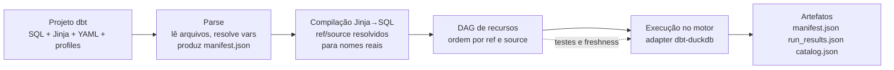

# Guia dbt — Parte 1: Fundamentos

> **Público-alvo:** engenheiro(a) de dados aprendendo dbt (ver persona em [PRODUCT.md](../../PRODUCT.md)).
> Todo exemplo usa nomes e arquivos **deste projeto** (pipeline RFB/CNPJ em dbt + DuckDB) — quando indicado
> por "desenho", o exemplo corresponde ao projeto conforme [ARCHITECTURE.md](../../ARCHITECTURE.md) (o diretório
> `transform/` é implementado ao longo deste port).
>
> **Parte 1 de 3** — ver também `02-fluxo-e-testes.md` e `03-bibliotecas-e-tecnicas.md` (em construção).

---

## Sumário

- [1. O que é o dbt](#1-o-que-é-o-dbt)
- [2. Como funciona](#2-como-funciona)
- [3. Conceitos](#3-conceitos)
- [4. Estrutura de um projeto típico](#4-estrutura-de-um-projeto-típico)
- [5. Como executar comandos](#5-como-executar-comandos)
- [6. Leituras recomendadas](#6-leituras-recomendadas)

---

## 1. O que é o dbt

O **dbt** (data build tool) é a ferramenta de transformação do ELT: é o **"T"**. Ele pega dados que já estão
acessíveis ao seu motor de consulta e os transforma de forma **versionada, testável e documentada** — com a
mesma disciplina de software (git, revisão, CI) que você usa para código.

- O que ele **faz**: lê um projeto de transformações escritas em **SQL + Jinja**, monta um grafo de
  dependências (DAG), compila o SQL, executa no warehouse/a plataforma de dados e registra tudo em artefatos.
- O que ele **NÃO faz**: não extrai dados de fontes externas e não os carrega — **não é um orquestrador de
  ingestão** nem um conector. Esse EL tem de vir de outra ferramenta.

Neste projeto o EL é **Python** (`src/rfb_pipeline/`): baixa os zips do WebDAV da RFB e os `csv.gz` da Base
dos Dados, converte tudo para Parquet em `raw/` e só então o dbt entra em cena. Essa divisão é uma decisão
explícita de arquitetura (ver [ADR-0002](../../docs/adr/0002-ingestao-python-raw-varchar.md)).

### dbt Core × dbt Cloud (dbt platform) × dbt Fusion engine

| | O que é | Onde roda | Custo |
|---|---|---|---|
| **dbt Core** | Software open-source (CLI `dbt`), escrito em Python + Jinja | Sua máquina / seu CI | Grátis |
| **dbt Cloud** (hoje "dbt platform") | Produto SaaS: Core + UI, agendamento, semântica, governança, API | Nuvem gerenciada dbt | assinatura |
| **dbt Fusion engine** | Novo motor em **Rust** para dbt, com compreensão real de SQL | Substitui o Core sob o mesmo authoring layer | em beta |

Detalhes honestos sobre o Fusion: foi anunciado em 2025 como um motor reescrito do zero em Rust (tecnologia
da [SDF](https://www.getdbt.com/blog/dbt-labs-acquires-sdf-labs)), prometendo parsing até 30× mais rápido e
compilação ~2× mais rápida, com o mesmo formato de projeto (SQL/Jinja/YAML) do Core. **Está em beta** e a
cobertura de adaptadores vem crescendo — os detalhes exatos de compatibilidade mudam rápido, então vale
*verificar na doc oficial* antes de adotar (links na [seção 6](#6-leituras-recomendadas)). Este projeto usa
**dbt Core 1.12** + adaptador **dbt-duckdb 1.11** (verificado em `dbt --version`).

### Por que o dbt e não só Python/Pandas?

O que o dbt agrega sobre scripts ad hoc:

1. **DAG implícito**: `ref()`/`source()` constroem o grafo; `dbt compile`/`run` executam na ordem certa.
2. **Testes de dados**: unicidade, não-nulos, relacionamentos, domínios — falhas falham o build.
3. **Documentação viva**: `dbt docs` gera um site com linhagem ligada ao código.
4. **Incrementalidade**: modelos só recalculam o que mudou (`materialized='incremental'`).
5. **Versionamento**: SQL é revisável como código; o estado está no git, não no banco.
6. **Determinismo e idempotência**: reexecutar um modelo é seguro.

---

## 2. Como funciona

O ciclo de vida de um comando dbt:



Passo a passo (o que acontece quando você roda `dbt run`, `dbt test`, `dbt build`, …):

1. **Projeto**: o dbt descobre tudo sob `transform/` (models, seeds, macros, snapshots, análises, testes) a
   partir de `dbt_project.yml`, e a conexão com o banco vem de `profiles.yml` (aqui, targets `ci`, `dev`,
   `s3` para DuckDB).
2. **Parse**: recursos são lidos; macros/vars são pré-resolvidos o suficiente para montar o **manifesto**
   (`target/manifest.json`), o catálogo de todos os nós do projeto. `dbt ls` já funciona nesta etapa.
3. **Compilação**: **Jinja é renderizado para SQL** — `{{ ref('bh_empresas') }}` se torna o nome real da
   relação no banco; condicionais (``), loops (``) e macros são
   expandidos. Resultado: para cada modelo, um arquivo SQL sob `target/compiled/`.
4. **DAG**: o grafo de dependências é derivado de todas as `ref()`/`source()` — o dbt **não analisa SQL**,
   são essas funções que declaram os nós. É por isso que elas são obrigatórias (nunca `from tabela` cru).
5. **Execução**: o SQL compilado roda no warehouse/catálogo **através do adapter** — aqui `dbt-duckdb`, que
   dispara as consultas no **DuckDB**. Cada nó vira `view`, `table`, arquivo Parquet externo, etc., conforme
   a materialização declarada.
6. **Artefatos**: `target/` guarda o estado da última execução:
   - `manifest.json` — todos os nós (models, testes, seeds, fontes, macros, exposures) e seus metadados;
   - `run_results.json` — resultado de cada nó na última execução (status, timing, erros, `error_if`/`warn_if`);
   - `catalog.json` — gerado por `dbt docs generate`, com colunas/tipos reais no banco.
   - `sources.json` — gerado por `dbt source freshness` com o estado de freshness.
   - `partial_parse.msgpack` — cache para reparse incremental; apagá-lo força parse completo.

> **Por que lê Parquet e escreve em `gold/`?** O adapter `dbt-duckdb` permite que fontes aponem para
> arquivos externos (`external_location`) e que modelos sejam **materializados como `external`** (Parquet em
> `gold/{modelo}.parquet`). O arquivo `.duckdb` é só um "orquestrador" descartável — os dados de verdade
> vivem nos Parquet (ADR-0001).

---

## 3. Conceitos

Cada conceito com uma definição curta e um exemplo com nomes deste projeto.

### 3.1 Models

Um **model** é um arquivo `.sql` (ou `.py`) com um `SELECT` — a unidade de transformação. O dbt o executa e
materializa conforme a configuração. Convenções: nome = nome do nó; pastas viram esquema/nomes compostos.

```sql
-- transform/models/marts/original/bh_empresas.sql (parcial, ilustrativo)
{{
    config(materialized='external')
}}
select
    e.cnpj_completo,
    e.nome_fantasia,
    ...
from {{ ref('stg_rfb__estabelecimentos') }} as e
```

Nomes de modelos se tornam o nome da relação: `stg_rfb__empresas`, `int_municipios__conformados`,
`fct_estabelecimentos`, `bh_empresas`, `mart_sobrevivencia_coorte` — todos com `snake_case` minúsculo neste
projeto.

### 3.2 Sources (fontes)

Uma **source** declara dados **fora** do projeto dbt — aqui, os Parquet em `raw/` gerados pelo EL Python.
`source('rfb', 'empresas')` referencia a tabela `empresas` da fonte `rfb`.

```yaml
# transform/models/staging/rfb/_rfb__sources.yml
version: 2
sources:
  - name: rfb
    meta:
      external_location: "{{ env_var('DATA_ROOT') }}/raw/rfb/{name}/mes_referencia=2026-09/*.parquet"
    tables:
      - name: empresas
        description: "Parquet bruto all-VARCHAR de Empresas0.zip"
      - name: estabelecimentos
```

No `dbt-duckdb`, o par `meta.external_location` + `config` diz ao adapter para ler **direto do Parquet**
(vira um `read_parquet(...)`) em vez de esperar tabela no DuckDB. Neste projeto **todas** as fontes RFB e
BD usam isso, derivando o caminho de `env_var('DATA_ROOT')` (arquivo em `data/` ou bucket `s3://`).

### 3.3 Seeds

**Seeds** são arquivos CSV/JSON/Parquet versionados no projeto, carregados pelo próprio dbt (`dbt seed`).
Para dimensões pequenas e estáveis que não vêm de uma fonte externa.

```csv
# transform/seeds/dominio_porte.csv
codigo,descricao
00,NAO INFORMADO
01,MICRO
03,PEQUENO
05,DEMAIS
```

No projeto: `dominio_porte`, `dominio_situacao_cadastral`, `dominio_matriz_filial`,
`excecoes_conhecidas_municipio`.

### 3.4 Snapshots (**SCD2**)

**Snapshots** capturam o **histórico de mudanças** de uma tabela — o padrão *slowly changing dimension
tipo 2* (SCD2). Cada alteração de uma linha gera uma nova versão com `dbt_valid_from`/`dbt_valid_to`, sem
destruir as anteriores:

```sql

{{ config(target_schema='main', unique_key='codigo',
          strategy='check', check_cols=['descricao']) }}
select * from {{ ref('stg_rfb__dominio_situacao') }}

```

**Neste projeto não usamos snapshots.** Motivo: o pipeline processa **um mês de referência por vez** e as
análises (concorrência, sobrevivência) são feitas sobre o snapshot mensal da RFB — o próprio dataset
mensal já *é* a "foto" de um momento. Manter SCD2 multiplicaria as tabelas sem responder a nenhuma pergunta
do produto (fora de escopo em [PRODUCT.md](../../PRODUCT.md)). Snapshots e SCD em geral são explicados em
detalhe na parte 3 (`03-bibliotecas-e-tecnicas.md`, em construção) como técnica para outros contextos.

### 3.5 Data tests (testes de dados) — introdução

**Data tests** executam uma consulta no banco e falham (ou apenas avisam) se ela retornar linhas. Há duas
modalidades (detalhamento em `02-fluxo-e-testes.md`):

- **Genéricos** — parametrizáveis e declarados em YAML: `unique`, `not_null`,
  `accepted_values`, `relationships`, `dbt_utils.*`, `dbt_expectations.*`.
- **Singulares** — uma consulta SQL livre em `transform/tests/` que deve retornar vazio.

```yaml
# transform/models/staging/rfb/_rfb__sources.yml (trecho)
columns:
  - name: cnpj_completo
    tests:
      - not_null
      - unique
      - dbt_utils.expression_is_true:
          expression: "length(cnpj_completo) = 14"
```

### 3.6 Unit tests (testes unitários)

**Unit tests** testam uma transformação **com dados de entrada fornecidos** (`given`/`expect`), sem precisar
do banco real — verificam a *lógica* do modelo, e não seus dados. Úteis para regras de negócio com poucas
linhas possíveis de entrada.

```yaml
# transform/models/staging/rfb/_stg_rfb__empresas__unit.yml
unit_tests:
  - name: stg_rfb__empresas_test_lpad_raiz
    model: stg_rfb__empresas
    given:
      - input: source('rfb', 'empresas')
        rows:
          - {cnpj_raiz: "1234", porte: "", capital_soc: "1.000,00"}
    expect:
      rows:
        - {cnpj_raiz: "00001234", porte_codigo: null, capital_social: 1000.00}
```

O projeto usa unit tests para as regras de staging (lpad, datas inválidas → NULL, parse de centróide) e dos
marts (elegibilidade de coorte, faixas de idade).

### 3.7 Macros e Jinja

O dbt usa o templater **Jinja** sobre o SQL. **Macros** são funções reutilizáveis em `transform/macros/`:

```sql
-- transform/macros/limpeza.sql

    case when {{ col }} = '' then null else {{ col }} end

```

Uso no modelo:

```sql
select
    {{ texto_ou_nulo('nome_fantasia') }} as nome_fantasia
from {{ source('rfb', 'estabelecimentos') }}
```

Jinja também controla fluxo: ``, ``, loops ``.
Macros podem compartilhar código entre modelos (aqui: `data_rfb`, `decimal_rfb`, `lpad_codigo`,
`filtro_mes_referencia`, `haversine_km`).

### 3.8 Packages

**Packages** são projetos dbt instaláveis de `packages.yml` (`dbt deps`) — bibliotecas de macros e testes
prontos. Este projeto usa (em `transform/packages.yml`):

```yaml
packages:
  - package: dbt-labs/dbt_utils
    version: [">=1.0.0", "<2.0.0"]
  - package: metaplane/dbt_expectations
    version: [">=0.10.0", "<1.0.0"]
```

### 3.9 Materializations

Materialização = **onde/como** o resultado do model é persistido.

| Materialização | O que cria | Uso neste projeto |
|---|---|---|
| `view` | uma visão no banco (barata; reconstrói a cada consulta) | staging (padrão) |
| `table` | tabela física (dados copiados na execução) | intermediate, observabilidade |
| `incremental` | tabela física que só processa o delta (`is_incremental()`) | `dq_historico_testes` |
| `ephemeral` | **não** cria artefato; vira CTE inline nos modelos que dependem dela | `paridade__bh_empresas_sql_original` |
| `external` *(dbt-duckdb)* | **arquivo externo** (Parquet/CSV/JSON) em `location` — os dados não entram no .duckdb | marts original/core/analises (`gold/*.parquet`) |

```sql
{{ config(materialized='external', location=".../gold/bh_empresas.parquet") }}
```

> No `dbt-duckdb`, `external` é o que entrega o "medalhão Parquet": o marts vira um arquivo em `gold/` que
> qualquer ferramenta lê. Suporta `table_function` (macros de tabela parametrizadas) e estratégias
> incrementais `append`, `delete+insert`, `merge` e `microbatch` para as materializações `table`.

### 3.10 `ref`, `source` e o DAG

- `{{ ref('nome_do_modelo') }}` → referencia **outro model/seed/snapshot**; cria a aresta do DAG e o dbt
  resolve a ordem automaticamente. Nome final = o nome do nó, ajustado por schema.
- `{{ source('nome_da_fonte', 'nome_da_tabela') }}` → referencia **uma fonte externa** (Parquet aqui).

Regra de ouro da ferramenta: **nunca** usar nome cru de tabela (`from bh_empresas`) — só `ref`/`source`
mantém o DAG, a seleção e o *defer* corretos. O DAG resolve: upstream de `mart_sobrevivencia_coorte` →
`fct_estabelecimentos` → `int_estabelecimentos__enriquecidos` → staging → fontes.

### 3.11 Vars

**Vars** são parâmetros do projeto definidos em `dbt_project.yml` ou na linha de comando (`--vars`), lidos
via `{{ var('...') }}`. Neste projeto (desenho em ARCHITECTURE §5.2):

```yaml
vars:
  mes_referencia: null        # null → maior _mes_referencia disponível
  data_referencia: null       # null → _data_referencia do mês (idade determinística)
  caso_cnae_alvo: '4741500'   # estudo de caso: varejo de tintas
  caso_municipio: 'FUNDÃO'
  caso_uf: 'ES'
  raio_fornecedores_km: 100
```

Sobrescrever sem editar o arquivo: `dbt run --vars "mes_referencia: 2025-01, caso_municipio: VITÓRIA"`.

### 3.12 Profiles e targets

**Profiles/targets** guardam a **conexão com o banco**. Um projeto pode ter vários *targets* (ambientes)
sob o mesmo profile. Em `transform/profiles.yml`:

```yaml
rfb:
  outputs:
    ci:
      type: duckdb
      path: "{{ env_var('DATA_ROOT') }}/ci.duckdb"
      threads: 2
    dev:
      type: duckdb
      path: "{{ env_var('DATA_ROOT') }}/warehouse.duckdb"
    s3:
      type: duckdb
      path: "{{ env_var('DATA_ROOT') }}/warehouse.duckdb"
      external_root: "s3://..."
  target: dev
```

- Escolher target: `--target ci` (ou `-t`). Bug comum: rodar em `dev` achando que é `prod`.
- `env_var()` injeta variáveis de ambiente (ex.: `DATA_ROOT`) — sem segredos no repo.
- `dbt debug` valida profiles/conexão; é o primeiro comando a rodar quando algo "não conecta".

### 3.13 Docs (`description` e `dbt docs`)

Cada model/coluna pode ter `description` (no YAML), que alimenta o site gerado por `dbt docs generate` +
`dbt docs serve`: catálogo + **linhagem** (DAG interativo) + colunas e testes. Descrições boas viram a
documentação viva do warehouse.

```yaml
- name: fct_estabelecimentos
  description: "Fato por estabelecimento (grão CNPJ completo), chaves para dimensões"
  columns:
    - name: cnpj_completo
      description: "CNPJ completo, 14 dígitos"
```

### 3.14 Exposures

**Exposures** declaram **dependências externas** (dashboard, relatório, modelo de ML) sobre os modelos —
para saber *quem é impactado* se um modelo mudar. Aqui há um exposure para o relatório do estudo de caso:

```yaml
exposures:
  - name: relatorio_estudo_caso
    type: dashboard
    depends_on:
      - ref('mart_concorrencia_municipio')
      - ref('mart_sobrevivencia_coorte')
```

### 3.15 Model contracts (contratos)

**Contracts** fixam a interface de um model — **nome, ordem e tipo das colunas** — e bloqueiam mudanças
acidentais de schema. `contract: {enforced: true}` + colunas declaradas na YAML:

```yaml
- name: bh_empresas
  config:
    contract:
      enforced: true
  columns:
    - name: cnpj_completo
      data_type: varchar
      constraints:
        - type: not_null
    - name: idade_atual
      data_type: double precision
```

Neste projeto: marts `original` e `core` têm contrato forçado (ARCHITECTURE §5.1).

### 3.16 `meta` e `tags` (governança de escopo)

- `tags` agrupam nós para seleção: `dbt ls --select tag:escopo_original`.
- `meta` carrega metadados arbitrários, exibidos em docs e lidos por ferramentas/CI.

Este projeto marca em **todo nó** `meta.escopo` ∈ `original`/`adicao`/`adaptado` + a tag correspondente
(`escopo_original`, `escopo_adicao`, `escopo_adaptado`) — decisão do [ADR-0006](../../docs/adr/0006-marcacao-escopo.md).
Um teste de CI falha se algum nó do projeto não tiver a marcação.

```yaml
- name: bh_empresas
  meta:
    scope: original
    escopo: original
  tags: ['escopo_original']
```

### 3.17 Selectors e sintaxe de seleção

**Selecionar nós** é o coração do dbt — roda só o que você quer, em qualquer *direção* do grafo. Sintaxe
passada a `--select`/`-s` (e combinável com `--exclude`):

| Exemplo | Significado |
|---|---|
| `dbt run --select bh_empresas` | só o model `bh_empresas` |
| `dbt run --select stg_rfb__estabelecimentos` | staging inteira |
| `dbt build --select +bh_empresas` | `bh_empresas` + **upstream** (tudo que ela precisa) |
| `dbt build --select bh_empresas+` | `bh_empresas` + **downstream** (quem depende dela) |
| `dbt build --select tag:escopo_original` | todos com a tag |
| `dbt run --select path:models/marts/core` | tudo sob o caminho |
| `dbt run --select source:rfb.*` | models que leem fontes da `rfb` |
| `dbt run --exclude bh_empresas` | tudo menos `bh_empresas` |
| `dbt ls --select state:modified --state target/` | nós cujo SQL mudou vs. o estado salvo (CI slim) |
| `dbt run --defer --state prod/` | resolve não-selecionados a partir do estado de produção |

- `+` no início = inclui **upstream** (ancestrais); `+` no fim = inclui **downstream** (descendentes).
  Quantifique o nº de arestas com o operador "n-plus": `2+my_model` sobe 2 níveis (pai e avô);
  `my_model+2` desce 2 níveis; `+my_model+` cobre ambos os lados. Existe ainda o operador `@my_model`,
  que traz descendentes **e os ancestrais de todos eles** (útil em CI quando os ancestrais podem não
  existir no schema).
- **Set operators** (dbt ≥ 1.12): **espaço entre critérios = união (OR)**; **vírgula sem espaço =
  interseção (AND)**. Ex.: `--select "tag:t1 tag:t2"` traz quem tem *pelo menos uma* das tags;
  `--select "tag:t1,tag:t2"` traz só quem tem *as duas*. Verificado na CLI — os antigos `or`/`and` como
  palavras não são mais operadores; para combinações nomeadas reutilizáveis, defina um **selector YAML**
  em `selectors.yml` com os equivalantes `union`/`intersection` e use `--selector nome`.
- `state:modified`, `state:new`, `state:unmodified` exigem `--state <dir>` (manifesto anterior).

> **Prática vital neste projeto (CI slim):** rodar `dbt build --select state:modified --state target/`
> sobre um manifesto de referência reconstroi **só o que mudou** e **nada a mais** — combinado com
> `--defer`, os modelos não-selecionados são resolvidos dos objetos de produção. É o padrão de CI
> documentado na parte 3 (`03-bibliotecas-e-tecnicas.md`, em construção).

---

## 4. Estrutura de um projeto típico

Árvore comentada de um projeto dbt (a deste projeto, conforme [ARCHITECTURE §3](../../ARCHITECTURE.md#3-estrutura-do-repositório)):

```
transform/
├── dbt_project.yml        # configuração do projeto: nome, perfil, vars, materializações por pasta
├── profiles.yml           # conexões (targets ci/dev/s3) — aqui versionado para didática
├── packages.yml           # dependências (dbt_utils, dbt_expectations) → dbt deps
├── models/
│   ├── staging/
│   │   ├── rfb/           # stg_<fonte>__<entidade>       (view; 1:1 com a fonte)
│   │   │   ├── _rfb__sources.yml
│   │   │   ├── stg_rfb__empresas.sql
│   │   │   └── stg_rfb__estabelecimentos.sql
│   │   └── basedosdados/  # stg_bd__municipios, stg_bd__cnaes, ...
│   ├── intermediate/      # int_<entidade>__<verbo>        (table; enriquecimentos/joins)
│   │   └── int_estabelecimentos__enriquecidos.sql
│   └── marts/
│       ├── original/      # bh_empresas, agg_empresas      (external → gold/)
│       ├── core/          # dim_*, fct_*, bridge_*         (external → gold/)
│       └── analises/      # mart_*                         (external → gold/)
├── macros/                # macros e testes genéricos customizados
├── tests/                 # testes singulares (.sql) e unit tests (em YAML junto aos models)
├── seeds/                 # parametrização estável (.csv): dominios, exceções
├── snapshots/             # SCD2 (documentado; não usado neste projeto)
├── analyses/              # queries ad-hoc/estudo de caso
└── target/                # gerado: manifest.json, run_results.json, catalog.json, compiled/
```

### Convenções da dbt Labs ("How we structure our dbt projects")

A recomendação oficial organiza o pipeline em camadas por *propósito*:

- **Staging**: 1:1 com as fontes; limpar/tipar colunas; **sem joins** (senão vira "craveling").
- **Intermediate**: joins/enriquecimentos; materializar `table` (aqui: `int_*__<verbo>`).
- **Marts**: tabelas finais para consumo (análise, BI, APIs) — por domínio/área.
- Nomear consistente e **descritivo**: `stg_`, `int_`, `dim_`, `fct_`, `mart_`.
- Metadata (descrições, testes, contratos) **na YAML perto do model**, não em arquivos separados.

### Como ESTE projeto segue / desvia

| Convenção dbt Labs | Este projeto (ARCHITECTURE §5.1) |
|---|---|
| staging 1:1, sem joins | ✅ segue (view; tipagem/limpeza apenas) |
| intermediate para joins | ✅ segue (`int_municipios__conformados`, `int_estabelecimentos__enriquecidos`, `int_cnaes_secundarios__explodidos`) |
| marts por domínio | ✅ segue (`original`, `core`, `analises`) |
| tipagem no staging | ✅ segue (raw é all-VARCHAR por decisão, ADR-0002) |
| materialização por camada | ✅ segue (view / table / external via config por pasta em `dbt_project.yml`) |
| contratos nos marts | ✅ segue (original e core com `contract.enforced`) |
| "análises" como queries temporárias | ✅ `analyses/` para o estudo de caso |
| schema por pasta (`schema:` auto) | ~ DuckDB é de catálogo único; usamos **prefixos** (`stg_`, `dim_`, `mart_`) + subpastas |
| golden/testes de dados junto ao model | ✅ segue |
| nome de model = `ref` direto | ✅ segue |
| governança `meta.escopo`/tags | ➕ **desvio intencional** para rastreabilidade original×adição (ADR-0006) |

> Detalhe de DuckDB: como o motor é um arquivo local com um único catálogo (`main`), não fazemos
> `schema: staging` por pasta — o padrão aqui é **prefixo de nome** (`stg_…`, `int_…`, `dim_…`) + a árvore de
> pastas para organização humana. Em Snowflake/BigQuery o padrão usual seria schema por camada.

---

## 5. Como executar comandos

Todos os comandos foram conferidos contra o **dbt Core 1.12.5** + `dbt-duckdb 1.11.0` (CLI real). O projeto
executa via `uv` — no repo: `uv run dbt <cmd>` (ou `cd transform && dbt <cmd>` se instalado).

### 5.1 Comandos principais

| Comando | Faz | Artefato/efeito |
|---|---|---|
| `dbt deps` | instala packages de `packages.yml` | `dbt_packages/` (gitignored) |
| `dbt debug` | valida `dbt_project.yml`, profiles e conexão | diagnóstico na tela |
| `dbt parse` | lê o projeto e monta o manifesto sem executar | `target/manifest.json` |
| `dbt compile` | renderiza Jinja→SQL de todos (ou selecionados) os models | `target/compiled/**/*.sql` |
| `dbt run` | **executa** os models selecionados (cria visões/tabelas/Parquet) | tabelas/Parquet + `run_results.json` |
| `dbt test` | roda os testes de dados | testes falham/avisam; `run_results.json` |
| `dbt build` | `seed` + `snapshot` + `run` + `test` em ordem de DAG | tudo de uma vez (**comando preferido**) |
| `dbt seed` | carrega os seeds (CSV) | tabelas de seeds |
| `dbt snapshot` | executa snapshots SCD2 | tabelas `*_snapshot` |
| `dbt source freshness` | checa a idade das fontes (vs. `loaded_at_field`) | `target/sources.json` |
| `dbt docs generate` | gera o site de docs (manifest + **catalog** do banco) | `target/catalog.json`, `index.html` |
| `dbt docs serve` | serve o site em localhost | navegador |
| `dbt ls` | lista nós selecionados (útil para debugar seleção) | saída em texto/JSON |
| `dbt show` | prévia o resultado de um model/inline (até N linhas) | tabela na tela |
| `dbt run-operation <macro>` | executa uma macro avulsa (ex.: `--args '{"arg": 1}'`) | efeito da macro |
| `dbt retry` | reexecuta nós que falharam na última execução | refaz só as partes quebradas |
| `dbt clone` | clona modelos de outro schema a partir do manifesto `--state` | exige warehouse com clone |

> `dbt fresh` / `dbt freshness` **não são comandos** — o correto é `dbt source freshness`.

### 5.2 Flags mais comuns

| Flag | Aplica-se a | Efeito |
|---|---|---|
| `-s, --select <nós>` | run/build/test/ls/docs/compile/seed… | seleciona nós (sintaxe da seção 3.17) |
| `--exclude <nós>` | idem | exclui nós |
| `--selector <nome>` | idem | usa um selector de `selectors.yml` (mais robusto que inline) |
| `-t, --target <nome>` | todos | troca de target/profiles (`ci`, `dev`, `s3`) |
| `--vars '{"chave": valor}'` | todos | sobrescreve vars do projeto |
| `-f, --full-refresh` | run/build (incremental/table) | reconstrói do zero (ignora cache incremental) |
| `-x, --fail-fast` | run/build/test | para na primeira falha (útil em CI) |
| `--empty` | run/build | roda com refs/sources vazios (testa DAG sem dados) |
| `--defer --state <dir>` | run/build/test | resolve não-selecionados pelo state do ambiente anterior |
| `--state <dir>` | ls/test | comparação para `state:modified`/`state:new`/`state:unmodified` |
| `--store-failures` | test | persiste linhas que falharam em tabelas `*_dbt_test__audit` |
| `--warn-error` | todos | trata avisos como erro (hardening) |

### 5.3 Exemplos com os alvos `make` deste projeto (ARCHITECTURE §7)

| Comando | Faz | Equivale a |
|---|---|---|
| `make setup` | ambiente completo | `uv sync` + `dbt deps` |
| `make fixtures` | gera fixtures sintéticas | `python scripts/gen_fixtures.py` (sem rede) |
| `make ci` | CI local verde | `rfb ingest --origem-local` + `dbt build --target ci` + pytest |
| `make pipeline MES=2026-09` | produção real | `rfb ingest` → `dbt source freshness` → `dbt build` → relatório |
| `make docs` | publicar docs | `dbt docs generate` + `dbt docs serve` |
| `make sync` | enviar `raw/`+`gold/` ao S3 | `rfb sync` (Tigris) |

Exemplos diretos (dentro de `transform/`):

```bash
# só o que mudou desde o último build (CI slim), deferindo o resto de produção
uv run dbt build --select state:modified --defer --state target/
# reconstruir inteiro o star schema sobre fixtures
uv run dbt build --select tag:escopo_adicao --target ci
# validar parse sem executar nada (rápido, ótimo em pre-commit)
uv run dbt parse --target ci
# só o mart de concorrência do Fundão, com força total, parando no 1º erro
uv run dbt run --select mart_concorrencia_municipio --full-refresh --fail-fast
# listar exatamente o escopo original (ADR-0006)
uv run dbt ls --select tag:escopo_original
# recalcular testes de fonte depois de reingerir
uv run dbt test --select source:rfb.*
```

---

## 6. Leituras recomendadas

Documentação e referências conferidas (todas respondem HTTP 200/301 na data desta escrita; docs.getdbt.com
agora usa o caminho `/docs/...` — URLs antigas como `/docs/build/ref` quebram/redirecionam, use as abaixo).

### dbt (docs.getdbt.com)

| Tópico | URL |
|---|---|
| Introdução | https://docs.getdbt.com/docs/introduction |
| Instalação (Core) | https://docs.getdbt.com/docs/core/installation-overview |
| Quickstart | https://docs.getdbt.com/docs/get-started-dbt |
| About dbt / modelos | https://docs.getdbt.com/docs/build/models |
| SQL models | https://docs.getdbt.com/docs/build/sql-models |
| Sources | https://docs.getdbt.com/docs/build/sources |
| Seeds | https://docs.getdbt.com/docs/build/seeds |
| Snapshots (SCD2) | https://docs.getdbt.com/docs/build/snapshots |
| Data tests | https://docs.getdbt.com/docs/build/data-tests |
| Unit tests | https://docs.getdbt.com/docs/build/unit-tests |
| Jinja & macros | https://docs.getdbt.com/docs/build/jinja-macros |
| Packages | https://docs.getdbt.com/docs/build/packages |
| Materializations | https://docs.getdbt.com/docs/build/materializations |
| Incremental models | https://docs.getdbt.com/docs/build/incremental-models |
| Project variables (`var()`) | https://docs.getdbt.com/docs/build/project-variables |
| Documentation | https://docs.getdbt.com/docs/build/documentation |
| Exposures | https://docs.getdbt.com/docs/build/exposures |
| Source freshness | https://docs.getdbt.com/docs/deploy/source-freshness |
| Profile / targets | https://docs.getdbt.com/docs/local/connection-profiles |
| profiles.yml | https://docs.getdbt.com/docs/local/profiles.yml |
| Setup DuckDB (adapter) | https://docs.getdbt.com/docs/local/connect-data-platform/duckdb-setup |
| dbt Core (versões) | https://docs.getdbt.com/docs/dbt-versions/core |
| Defer / CI | https://docs.getdbt.com/docs/platform/about-defer |
| Seleção de nós — sintaxe | https://docs.getdbt.com/reference/node-selection/syntax |
| Seleção de nós — métodos | https://docs.getdbt.com/reference/node-selection/methods |
| Seleção de nós — operadores do grafo | https://docs.getdbt.com/reference/node-selection/graph-operators |
| Seleção de nós — set operators | https://docs.getdbt.com/reference/node-selection/set-operators |
| Seleção de nós — state | https://docs.getdbt.com/reference/node-selection/state-selection |
| Selectors YAML | https://docs.getdbt.com/reference/node-selection/yaml-selectors |
| `ref()` (Jinja) | https://docs.getdbt.com/reference/dbt-jinja-functions/ref |
| `source()` (Jinja) | https://docs.getdbt.com/reference/dbt-jinja-functions/source |
| `config()` (Jinja) | https://docs.getdbt.com/reference/dbt-jinja-functions/config |
| Contratos (`contract`) | https://docs.getdbt.com/reference/resource-configs/contract |
| Referência de comandos (CLI) | https://docs.getdbt.com/reference/dbt-commands |
| Comando `run` | https://docs.getdbt.com/reference/commands/run |
| Comando `build` | https://docs.getdbt.com/reference/commands/build |
| Comando `test` | https://docs.getdbt.com/reference/commands/test |
| Comando `ls` | https://docs.getdbt.com/reference/commands/list |
| Comando `docs` | https://docs.getdbt.com/reference/commands/cmd-docs |
| Comando `source freshness` | https://docs.getdbt.com/reference/commands/source |
| Best practices — estrutura ("How we structure") | https://docs.getdbt.com/best-practices/how-we-structure/1-guide-overview |
| Best practices — estilo ("How we style") | https://docs.getdbt.com/best-practices/how-we-style/0-how-we-style-our-dbt-projects |
| Fusion engine (anúncio / blog) | https://docs.getdbt.com/blog/dbt-fusion-engine |
| Dbt Fusion (produto) | https://www.getdbt.com/product/fusion |

### dbt-duckdb e DuckDB

| Tópico | URL |
|---|---|
| dbt-duckdb (adapter oficial) | https://github.com/duckdb/dbt-duckdb |
| DuckDB docs | https://duckdb.org/docs/ |

### Neste repositório

- [ARCHITECTURE.md](../../ARCHITECTURE.md) — arquitetura do projeto (camadas, materializações, vars, DQ).
- [docs/adr/README.md](../adr/README.md) — registro de decisões (ADR-0002: EL em Python; ADR-0004: data
  determinística; ADR-0006: marcação de escopo; ADR-0009: estratégia de testes).
- [docs/ESCOPO.md](../ESCOPO.md) — original × adição (a "tabela humana" do `meta.escopo`).
- [PRODUCT.md](../../PRODUCT.md) — produto e personas (o porquê das escolhas).

---

*Voltar ao [README do guia](../../README.md#documentos).*
