# Guia Completo de dbt e Engenharia Analítica

> Este guia documenta a arquitetura, os fundamentos, o fluxo de dados, a suíte de testes de qualidade e as melhores práticas adotadas na migração do pipeline da Receita Federal (dados de CNPJ e Base dos Dados) de um MVP Spark/Databricks para **dbt-core 1.12 + dbt-duckdb 1.11 + DuckDB 1.5** sobre arquivos Parquet e armazenamento local ou S3/Tigris.

---

## 📚 Índice dos Módulos do Guia

O guia está organizado em 5 partes complementares e progressivas:

| Módulo | Documento | Principais Tópicos Cobertos |
|---|---|---|
| **Parte 1** | [**01. Fundamentos**](01-fundamentos.md) | O que é o dbt; ciclo de vida Parse → Compile → Execute; conceitos centrais (models, sources, seeds, snapshots, materializations, contracts, vars, profiles); árvore de diretórios; sintaxe da CLI e operadores de seleção (`union` vs. `intersection`); **armadilhas comuns** (P1, locks no DuckDB, `is_incremental`). |
| **Parte 2** | [**02. Fluxo de Dados e Testes**](02-fluxo-e-testes.md) | O fluxo completo camada por camada (Raw → Staging → Intermediate → Marts Original → Marts Core → Marts Analytics → Observabilidade) com **SQL compilado real** e **contagens exatas das fixtures de teste**; todos os tipos de teste dbt (genéricos, singulares, limiares `warn_if`/`error_if`, `store_failures`, unit tests com `format: sql` para fontes externas — P8). |
| **Parte 3** | [**03. Qualidade Antes e Depois por Etapa**](03-qualidade-antes-e-depois.md) | Matriz completa de **Pré-condições ("Antes") × Pós-condições ("Depois")** para cada uma das 9 fases do pipeline (ingestão Python, raw, staging, intermediate, marts original, core, analytics, gold/BI e atualização mensal); padrões de Data Quality (reconciliação contábil, data diff, quarentena, testes de mutação, filosofia "shift-left") e **checklist copiável**. |
| **Parte 4** | [**04. Bibliotecas, Ferramentas e Técnicas Avançadas**](04-bibliotecas-e-tecnicas.md) | Ecossistema estendido de ferramentas analíticas: `dbt_utils`, `dbt_expectations`, `sqlfluff`, `dbt-audit-helper`, `elementary`, `dbt-project-evaluator`, alternativas (Great Expectations, Soda, re_data); recursos do `dbt-duckdb` (`external`, extensões S3/httpfs); estratégias incrementais; CI Slim com `state:modified` + `--defer`; `dbt retry` e `dbt clone`. |
| **Parte 5** | [**05. Boas Práticas, Performance e Usos Interessantes**](05-boas-praticas-e-usos.md) | Melhores práticas de engenharia de software aplicadas a SQL; convenções de nomenclatura bilíngue ([ADR-0014](../adr/0014-convencao-idioma.md)); contratos e governança (`meta`, `tags`); **otimização de performance no DuckDB** (gestão de memória, spill to disk, concorrência `DBT_THREADS` × `DUCKDB_THREADS`, particionamento Hive); operação e a **primeira execução lenta (P9)**; casos avançados (dbt como camada semântica, exposures, `dbt show`, `analyses/`, telemetria via hooks e catálogo gerado a partir do manifest). |

---

## 🗺️ Trilhas de Leitura por Persona

Para maximizar o aproveitamento deste material conforme seu objetivo e senioridade, recomendamos seguir uma das trilhas abaixo:

```mermaid
flowchart TD
    classDef iniciante fill:#e8f5e9,stroke:#388e3c,stroke-width:1px;
    classDef analista fill:#e1f5fe,stroke:#0288d1,stroke-width:1px;
    classDef engenheiro fill:#fff3e0,stroke:#f57c00,stroke-width:1px;

    subgraph TRILHA_INICIANTE["Trilha 1: Iniciante em dbt / Migração de SQL tradicional"]
        I1["1. Fundamentos (Parte 1)<br/>Conceitos, ciclo de vida e comandos CLI"]:::iniciante
        I2["2. Fluxo e Testes (Parte 2)<br/>Ver o SQL compilado real e como os dados fluem"]:::iniciante
        I3["3. Checklist de Qualidade (Parte 3, Seção 4)<br/>Guia prático para criar novos modelos sem errar"]:::iniciante
        I1 --> I2 --> I3
    end

    subgraph TRILHA_ANALISTA["Trilha 2: Analista de Dados e Especialista em BI"]
        A1["1. Guia Power BI (docs/POWER_BI.md)<br/>Modelo estrela, medidas DAX e conexões"]:::analista
        A2["2. Camadas Core e Analytics (Parte 2, Seções 2.5 e 2.6)<br/>Regras de negócio de dim_*, fct_* e marts"]:::analista
        A3["3. dbt como Camada Semântica (Parte 5, Seção 3)<br/>Exposures, estudos de caso e analyses/"]:::analista
        A1 --> A2 --> A3
    end

    subgraph TRILHA_ENGENHEIRO["Trilha 3: Engenheiro(a) de Dados e Arquiteto(a)"]
        E1["1. Arquitetura e Decisões Técnicas<br/>ARCHITECTURE.md + docs/adr/README.md"]:::engenheiro
        E2["2. Matrizes de Qualidade e Shift-Left (Parte 3)<br/>Pré e pós-condições, reconciliação e data diff"]:::engenheiro
        E3["3. Performance no DuckDB e Técnicas Avançadas (Partes 4 e 5)<br/>Memória, threads, Parquet, CI slim e telemetria"]:::engenheiro
        E1 --> E2 --> E3
    end
```

### 1. Trilha: Iniciante em dbt (Transição de scripts SQL/Python)
- **Objetivo**: Entender o que é o dbt, como ele se posiciona no ecossistema e como executar modelos no dia a dia.
- **Roteiro sugerido**:
  1. Leia [Parte 1: Fundamentos](01-fundamentos.md) integralmente para entender como Jinja e SQL se unem e evitar as armadilhas comuns da CLI.
  2. Siga para [Parte 2: Fluxo de Dados e Testes](02-fluxo-e-testes.md) para ver como um dado bruto se transforma progressivamente até a camada Gold.
  3. Adote o **Checklist Copiável** de [Parte 3: Qualidade Antes e Depois](03-qualidade-antes-e-depois.md#4-checklist-copiável-de-qualidade) em todo modelo novo que você for codificar.

### 2. Trilha: Analista de Dados / Especialista em BI (Power BI, Tableau)
- **Objetivo**: Compreender a modelagem dimensional Kimball, as regras de negócio dos indicadores e como consumir os dados com segurança.
- **Roteiro sugerido**:
  1. Comece pelo guia de integração analítica: [docs/POWER_BI.md](../POWER_BI.md).
  2. Estude a modelagem dimensional em [Parte 2: Seção 2.5 (Core) e 2.6 (Analytics)](02-fluxo-e-testes.md#25-camada-marts-core-modelo-estrela-dimensional-kimball).
  3. Veja como documentar dependências em [Parte 5: Seção 3.2 (Exposures)](05-boas-praticas-e-usos.md#32-mapeamento-de-linhagem-downstream-com-exposures) e como o dbt serve de camada semântica unificada.

### 3. Trilha: Engenheiro(a) de Dados / Arquiteto(a) de Plataforma
- **Objetivo**: Dominar a engenharia profunda, garantia de qualidade, otimização de recursos computacionais e automação de CI/CD.
- **Roteiro sugerido**:
  1. Revise a arquitetura global em [ARCHITECTURE.md](../../ARCHITECTURE.md) e as decisões de design em [docs/adr/README.md](../adr/README.md).
  2. Aprofunde-se na engenharia defensiva em [Parte 3: Qualidade Antes e Depois](03-qualidade-antes-e-depois.md) (reconciliação contábil, data diff e testes de mutação).
  3. Domine os limites operacionais do DuckDB em [Parte 5: Otimização de Performance no DuckDB](05-boas-praticas-e-usos.md#2-otimização-de-performance-no-duckdb) e técnicas de CI Slim em [Parte 4: Seção 5](04-bibliotecas-e-tecnicas.md#5-técnicas-avançadas-de-engenharia-de-dados).

---

## 🔗 Conexões com Outros Documentos do Repositório

Este guia é parte integrante da documentação de engenharia deste projeto e se conecta diretamente aos seguintes artefatos:

- [**ARCHITECTURE.md**](../../ARCHITECTURE.md): Desenho sistêmico global, fluxo de dados, divisão de responsabilidades Python vs. dbt, e infraestrutura de armazenamento.
- [**docs/adr/README.md**](../adr/README.md): Índice dos 14 Registros de Decisão Arquitetural (ADRs), incluindo:
  - [ADR-0001](../adr/0001-duckdb-dbt-parquet.md): Escolha do dbt-duckdb e Parquet como motor analítico.
  - [ADR-0002](../adr/0002-ingestao-python-raw-varchar.md): Ingestão em Python e preservação All-VARCHAR.
  - [ADR-0004](../adr/0004-data-referencia-deterministica.md): Cálculo determinístico de datas de referência e idade.
  - [ADR-0005](../adr/0005-paridade-modelos-originais.md): Garantia de paridade estrita com o SQL legado.
  - [ADR-0006](../adr/0006-marcacao-escopo.md): Governança de escopo via `meta.escopo` e `tags`.
  - [ADR-0007](../adr/0007-armazenamento-local-s3.md): Arquitetura híbrida de armazenamento local e buckets S3/Tigris.
  - [ADR-0008](../adr/0008-minimizacao-dados-pessoais.md): Conformidade com a LGPD e descarte de dados de contato.
  - [ADR-0009](../adr/0009-estrategia-testes.md): Estratégia e taxonomia da suíte de testes.
  - [ADR-0013](../adr/0013-modelo-estrela-bi.md): Desenho do modelo estrela dimensional para BI.
  - [ADR-0014](../adr/0014-convencao-idioma.md): Política de nomenclatura bilíngue do repositório.
- [**docs/QUALIDADE_DADOS.md**](../QUALIDADE_DADOS.md): Catálogo completo e exaustivo de todos os testes de dados do projeto, gerado automaticamente a partir do manifesto dbt.
- [**docs/ESCOPO.md**](../ESCOPO.md): Mapeamento transparente de equivalência entre o código original dos notebooks Databricks e a implementação moderna em dbt.
- [**docs/POWER_BI.md**](../POWER_BI.md): Guia detalhado de modelagem dimensional, relacionamentos de cardinalidade e fórmulas DAX para conectar ferramentas de BI à camada Gold.
- [**PRODUCT.md**](../../PRODUCT.md): Visão de produto, proposta de valor, dores do usuário e personas atendidas por esta solução analítica.
